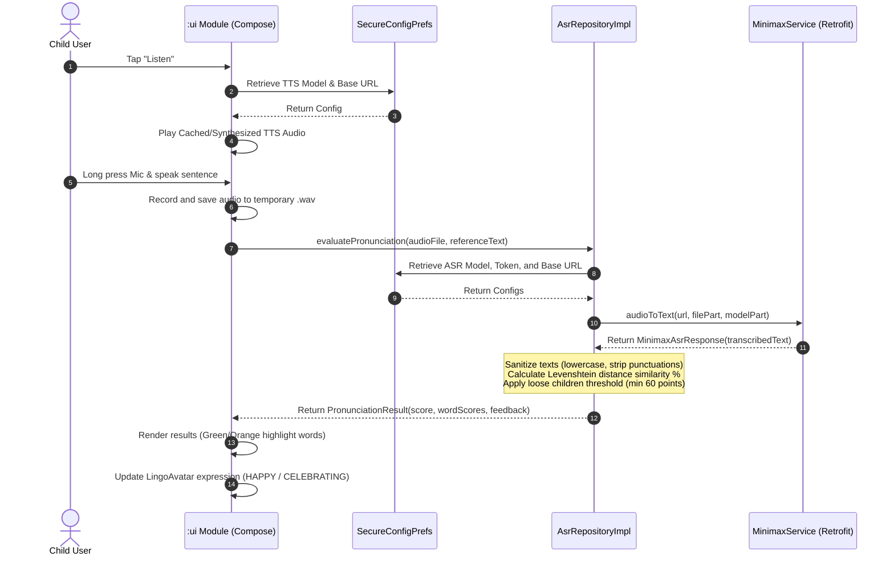
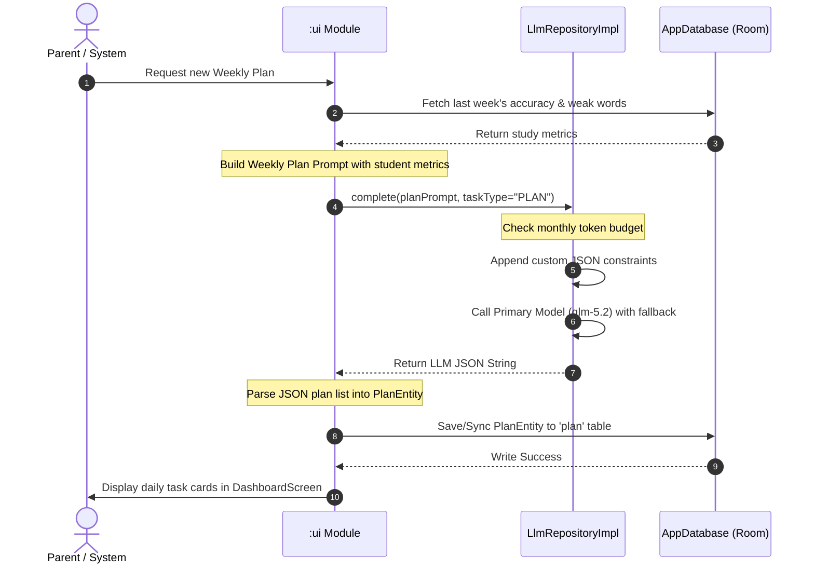
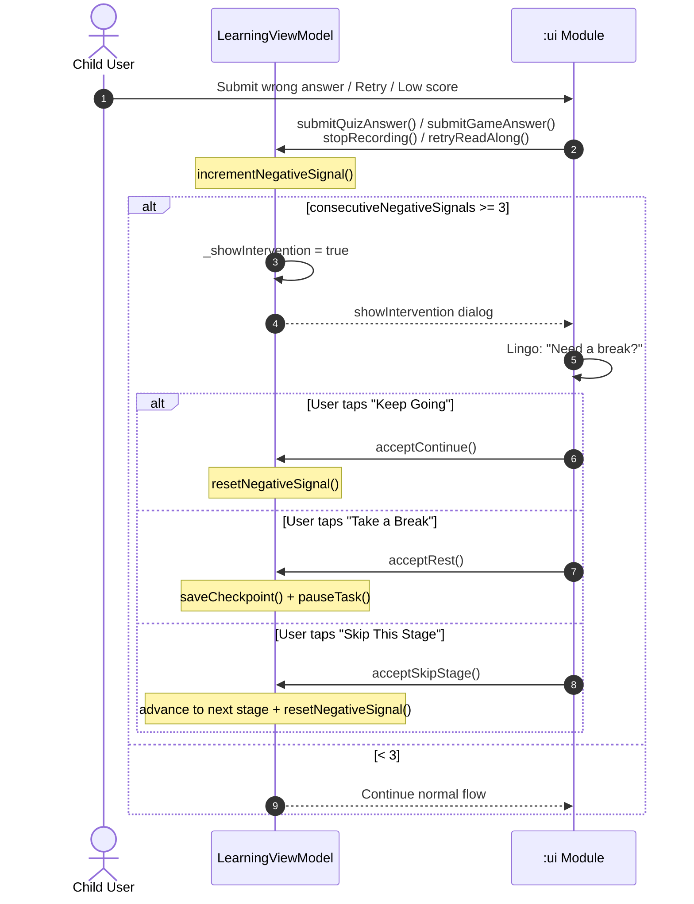

# Lingo English — AI Agent Design & Sequence Workflows

This document outlines the architecture, prompts, and sequence flows of the AI agents integrated into Lingo English. 

---

## 🤖 Agent System Overview

Lingo English operates four distinct agent roles to support the student's learning lifecycle:
1. **Weekly Plan Generator**: Analyzes last week's accuracy and vocabulary milestones to output a structured weekly curriculum.
2. **Pronunciation Evaluator (ASR-driven)**: Transcribes the child's recorded voice and compares it against standard reference sentences using Levenshtein distance matching.
3. **Explanation Agent (Error Book Guide)**: Provides friendly, bite-sized contextual explanations for mistakes stored in the Error Book.
4. **Daily Encourager & Notification Trigger**: Generates personalized push alerts and daily completion badges to boost motivation.

---

## 📊 Core Sequence Flows

### 1. Daily Oral Learning & Assessment Flow
This sequence illustrates how a user listens to a TTS model demonstration, records their voice, triggers the ASR transcriber, performs Levenshtein evaluation, and receives interactive feedback.



### 2. Weekly Plan Generation & Sync Flow
This sequence details how study records are collected, formatted into a prompt, evaluated by the LLM, parsed into a structured JSON plan, and written to the local Room database.



### 4. Emotional Intervention Flow
Triggered after 3 consecutive negative signals (wrong quiz answer, low ASR score, retry, recording failure) within a single stage. Resets on correct answer or stage transition.



---

## 📝 Prompt Templates

### 1. Weekly Plan Generator Prompt (JSON output constraint)
Used to generate a structured 7-day study plan.

```
You are the curriculum planner for Lingo English. 
Your task is to generate a personalized 7-day English learning plan for a student in {grade} using {textbook} textbook.

--- Student Learning History ---
- Average Accuracy: {accuracy}%
- Weak Word Categories: {weak_categories}
- Completed Milestones: {completed_milestones}

--- Constraints & Output Format ---
You must output a raw, valid JSON object ONLY. Do not write markdown blocks like ```json or any prefix text. The JSON must match the following structure:
{
  "theme": "Unit theme name",
  "difficulty_coefficient": 1.2,
  "days": [
    {
      "day": 1,
      "focus": "Vocabulary / Grammar / Dialogue",
      "target_words": ["word1", "word2"],
      "reference_sentence": "Standard practice sentence of the day",
      "duration_minutes": 15
    }
  ]
}
```

### 2. Explanation Agent Prompt (Error Book Guide)
Generates simple, kid-friendly explanations for misspelled or mispronounced words.

```
You are Lingo, a friendly fox tutor. Explain the word "{word}" to a {grade} child.
The child got this word wrong in a quiz due to: {error_type}.

--- Guidelines ---
1. Use encouraging, warm, and simple English.
2. Provide one clear example sentence suitable for children.
3. Highlight a quick mnemonic trick or spelling tip (e.g., "hear has an 'ear' inside it").
4. Keep the explanation under 100 words. Do not be overly academic.
```

### 3. Emotional Intervention Prompt (Resilient Learning Engine)
Sprint 5 — triggered after 3 consecutive negative signals (wrong answers, low ASR scores, retries).

```
You are Lingo, a compassionate fox tutor. A student named {name} has encountered several difficulties in a row.

--- Guidelines ---
1. Acknowledge the frustration without dwelling on it — be warm and matter-of-fact.
2. Offer three choices: (a) take a short break, (b) keep going, or (c) skip this part.
3. Use encouraging, pressure-free language.
4. Keep the message under 60 words.
5. Do NOT mention scores, grades, or performance.
```

### 4. Daily Encourager Prompt
Creates badges and warm greetings.

```
You are the motivational assistant for Lingo English.
Generate a short push notification or banner greeting for a student named {name} who is on a {streak} day streak.

--- Tone and Rules ---
- Enthusiastic, warm, and gamified.
- Must be less than 40 characters.
- Use exactly 1 appropriate emoji.
- Do not mention tasks as "unfinished" or "obligations". Use invitations instead.
```
