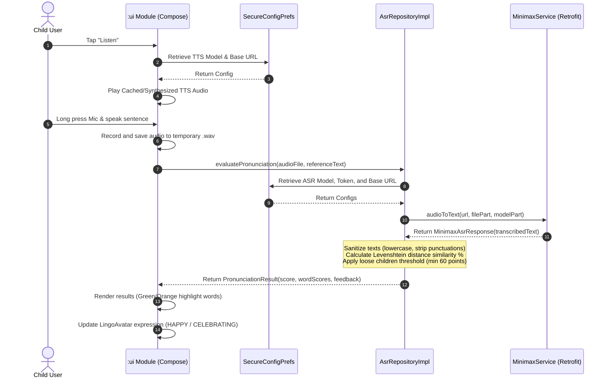
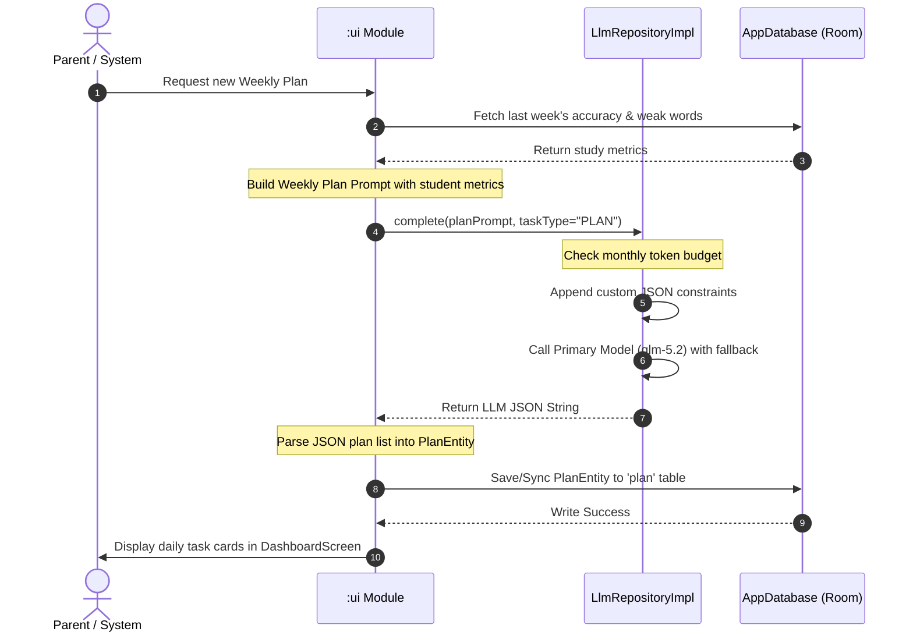
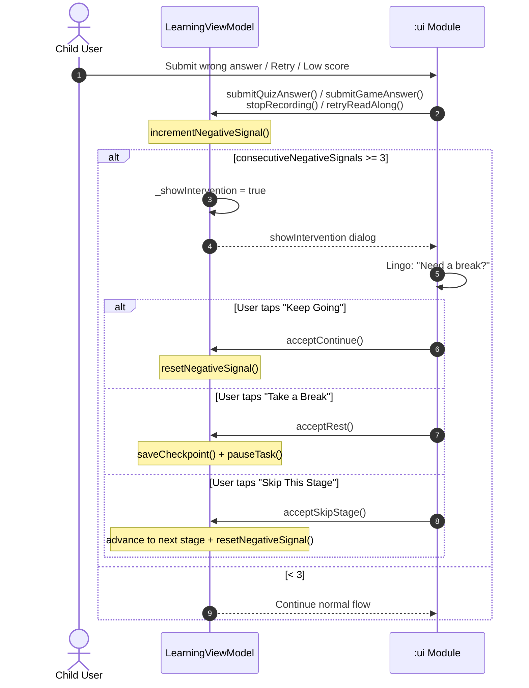
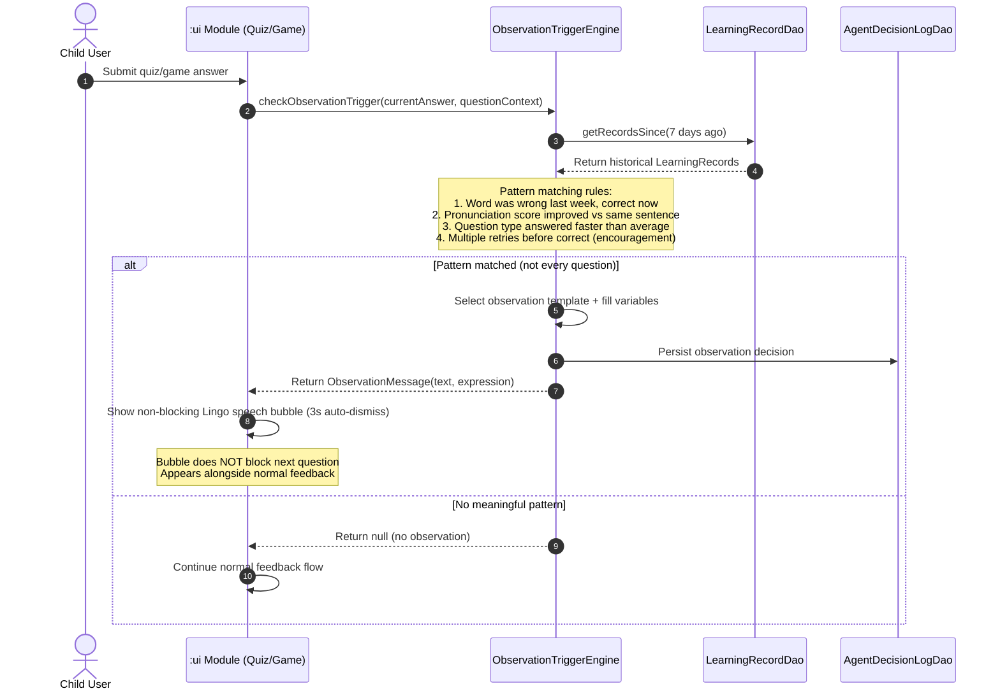
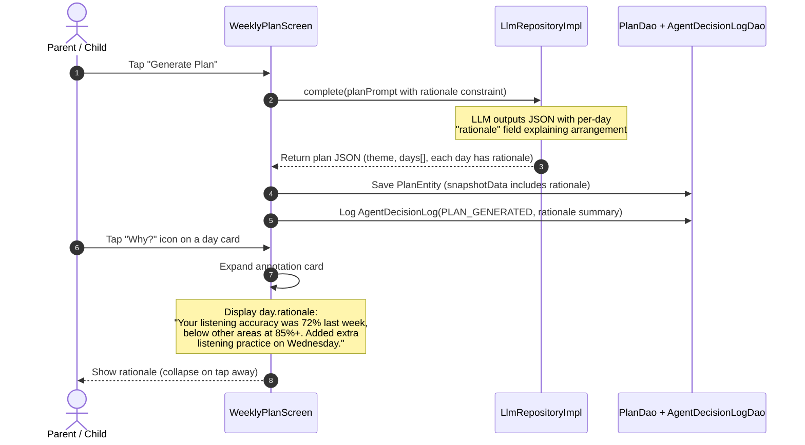
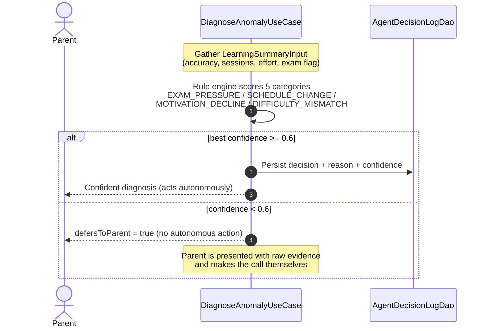
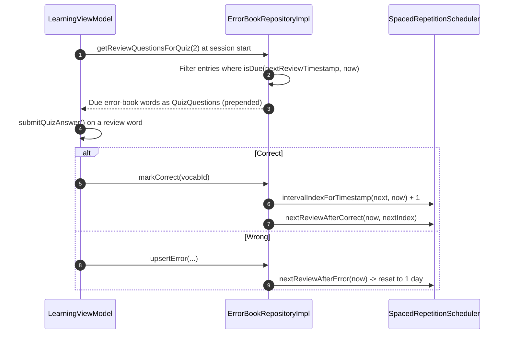

# Lingo English — AI Agent Design & Sequence Workflows

This document outlines the architecture, prompts, and sequence flows of the AI agents integrated into Lingo English. 

---

## 🤖 Agent System Overview

Lingo English operates six distinct agent roles to support the student's learning lifecycle:
1. **Weekly Plan Generator**: Analyzes last week's accuracy and vocabulary milestones to output a structured weekly curriculum with per-day rationale.
2. **Pronunciation Evaluator (ASR-driven)**: Transcribes the child's recorded voice and compares it against standard reference sentences using Levenshtein distance matching.
3. **Explanation Agent (Error Book Guide)**: Provides friendly, bite-sized contextual explanations for mistakes stored in the Error Book.
4. **Daily Encourager & Notification Trigger**: Generates personalized push alerts and daily completion badges to boost motivation.
5. **Observation Agent (Lingo Observes)**: Monitors the child's real-time learning event stream and surfaces cross-time, cross-task insights (e.g., "this word you missed last week — you got it right now!") via non-blocking speech bubbles during Quiz/Game stages. Differs from per-question feedback by performing **longitudinal comparison** against `LearningRecord` history.
6. **Decision Transparency Layer**: Persists every significant agent judgment (plan generated, difficulty adjusted, observation made, error pattern detected) into an `AgentDecisionLog` table, enabling three user-facing surfaces: (a) Plan page "Why this arrangement?" expandable annotation, (b) Weekly Report "What Lingo adjusted this week" section, (c) AI Growth Notes timeline page. This is not a new AI capability — it exposes the reasoning that was already happening but invisible to users.

> **Design Principle (Sprint 6)**: "Making AI presence visible" ≠ "adding spinning animations pretending to think." True visibility means exposing the judgment process and evidence that was already happening behind the scenes — letting users see not just "the result" but "how the result came to be" and "what the AI noticed that others wouldn't."

---

## 📊 Core Sequence Flows

### 1. Daily Oral Learning & Assessment Flow
This sequence illustrates how a user listens to a TTS model demonstration, records their voice, triggers the ASR transcriber, performs Levenshtein evaluation, and receives interactive feedback.



### 2. Weekly Plan Generation & Sync Flow
This sequence details how study records are collected, formatted into a prompt, evaluated by the LLM, parsed into a structured JSON plan, and written to the local Room database.



### 4. Emotional Intervention Flow
Triggered after 3 consecutive negative signals (wrong quiz answer, low ASR score, retry, recording failure) within a single stage. Resets on correct answer or stage transition.



### 5. Lingo Observation Flow (Sprint 6 - AI Presence)
Triggered during Quiz/Game stages when a meaningful pattern is detected via longitudinal comparison against `LearningRecord` history. Not every question triggers an observation - only specific, personalized patterns to avoid noise.



**Key distinction from per-question feedback**: Per-question feedback (correct/wrong animation) is already built into Sprint 2. Observations are **cross-time, cross-task** comparisons that only a system with memory of this child's history can produce. They are deliberately sparse (triggered by rules, not every question) to avoid becoming noise.

### 6. Plan Rationale & "Why" Annotation Flow (Sprint 6 - AI Presence)
When a weekly plan is generated, the LLM now outputs a per-day `rationale` field. This is displayed as an expandable "Why this arrangement?" annotation on each plan day card.



---

## 📝 Prompt Templates

### 1. Weekly Plan Generator Prompt (JSON output constraint)
Used to generate a structured 7-day study plan with per-day rationale.

```
You are the curriculum planner for Lingo English. 
Your task is to generate a personalized 7-day English learning plan for a student in {grade} using {textbook} textbook.

--- Student Learning History ---
- Average Accuracy: {accuracy}%
- Weak Word Categories: {weak_categories}
- Completed Milestones: {completed_milestones}

--- Constraints & Output Format ---
You must output a raw, valid JSON object ONLY. Do not write markdown blocks like ```json or any prefix text. The JSON must match the following structure:
{
  "theme": "Unit theme name",
  "difficulty_coefficient": 1.2,
  "days": [
    {
      "day": 1,
      "focus": "Vocabulary / Grammar / Dialogue",
      "target_words": ["word1", "word2"],
      "reference_sentence": "Standard practice sentence of the day",
      "duration_minutes": 15,
      "rationale": "One sentence explaining WHY this day's content was arranged this way, referencing the student's specific learning history (e.g., 'Your listening accuracy was 72% last week, so today focuses on listening-intensive vocabulary')"
    }
  ]
}
```

### 2. Explanation Agent Prompt (Error Book Guide)
Generates simple, kid-friendly explanations for misspelled or mispronounced words.

```
You are Lingo, a friendly fox tutor. Explain the word "{word}" to a {grade} child.
The child got this word wrong in a quiz due to: {error_type}.

--- Guidelines ---
1. Use encouraging, warm, and simple English.
2. Provide one clear example sentence suitable for children.
3. Highlight a quick mnemonic trick or spelling tip (e.g., "hear has an 'ear' inside it").
4. Keep the explanation under 100 words. Do not be overly academic.
```

### 3. Emotional Intervention Prompt (Resilient Learning Engine)
Sprint 5 — triggered after 3 consecutive negative signals (wrong answers, low ASR scores, retries).

```
You are Lingo, a compassionate fox tutor. A student named {name} has encountered several difficulties in a row.

--- Guidelines ---
1. Acknowledge the frustration without dwelling on it — be warm and matter-of-fact.
2. Offer three choices: (a) take a short break, (b) keep going, or (c) skip this part.
3. Use encouraging, pressure-free language.
4. Keep the message under 60 words.
5. Do NOT mention scores, grades, or performance.
```

### 4. Daily Encourager Prompt
Creates badges and warm greetings.

```
You are the motivational assistant for Lingo English.
Generate a short push notification or banner greeting for a student named {name} who is on a {streak} day streak.

--- Tone and Rules ---
- Enthusiastic, warm, and gamified.
- Must be less than 40 characters.
- Use exactly 1 appropriate emoji.
- Do not mention tasks as "unfinished" or "obligations". Use invitations instead.
```

### 5. Observation Agent Prompt (Sprint 6 - AI Presence)
Generates personalized, cross-time insights during Quiz/Game stages. Uses template-first approach with LLM enrichment only for complex patterns.

```
You are Lingo, a fox tutor who remembers everything about your student {name}.
The student just answered a question and a meaningful pattern was detected:

--- Pattern Detected ---
{pattern_description}
Example: "The word 'classroom' was answered wrong in last week's quiz, but the student just answered it correctly today."

--- Student Context ---
- Word/Question: {current_word}
- Previous record: {previous_record}
- Current performance: {current_performance}

--- Guidelines ---
1. Acknowledge the improvement or pattern in ONE short sentence (max 20 words).
2. Be warm and specific - reference the actual word or skill, not generic praise.
3. Do NOT use phrases like "AI noticed" or "the system detected" - speak as Lingo naturally.
4. Use child-friendly language with at most 1 emoji.
5. If the pattern is about struggle (multiple retries), be encouraging, never judgmental.
```

---

## 🎓 Sprint 7: Pedagogical Deepening & Agent Intelligence

### New Capabilities

Sprint 7 adds bounded-autonomy Agent decision-making and core pedagogical activities on top of the Sprint 6 AI Presence infrastructure:

1. **DiagnoseAnomalyUseCase (Bounded-Autonomy Agent)**: Consumes a structured learning summary (last/previous week accuracy, session counts, avg session minutes, exam period flag, retry rate) and maps it to one of five predefined categories (EXAM_PRESSURE / SCHEDULE_CHANGE / MOTIVATION_DECLINE / DIFFICULTY_MISMATCH / UNCERTAIN) with a confidence score. **Bounded**: when confidence < 0.6 it does NOT act autonomously — it defers the decision to the parent (`defersToParent = true`).
2. **SpacedRepetitionScheduler**: Ebbinghaus review intervals (1/3/7/14 days). Each error-book word's `nextReviewTimestamp` drives whether it is re-inserted into the daily Quiz. A correct answer advances to the next interval; a repeated mistake resets to day 1.
3. **PhonicsModule**: For the PRIMARY band, generates CVC build / onset-rime / minimal-pairs blending questions from curated letter-tile banks.
4. **ProductionTaskScorer**: Deterministic grading for SPELLING (Levenshtein partial credit), DICTATION (word overlap), and SENTENCE_WRITING (target word presence + length).
5. **AdaptiveDifficultyEngine**: Adjusts sentence length (±3 words, clamped 4..22) and CEFR level from last quiz accuracy; `describeAdjustment()` produces a human-readable string for `AgentDecisionLog` (DIFFICULTY_ADJUSTED).
6. **XpRewardSystem + DailyGoalTracker + MakeupCardManager**: XP/level progression, daily 3-goal badges, and the 2-per-month makeup card (streak break → active choice, never auto-use).

### Bounded-Autonomy Decision Flow (Phase B)



### Spaced Repetition in the Daily Quiz (Phase A4)



### Phonic Blending Question Generation (Phase A3)

`PhonicsModule.buildPhonicsQuestion(word, questionId)`:
- Normalizes to lowercase, parses as CVC (consonant-vowel-consonant).
- Rotates activity type by `questionId % 3` so children see variety:
  - `0` → **CVC_BUILD** (arrange onset/vowel/coda tiles + 3 distractors into the correct order; answer expressed via `correctOrder`)
  - `1` → **ONSET_RIME** (pick the rime completing "onset + ? = word" from 4 rime options)
  - `2` → **MINIMAL_PAIRS** (listen and tap the word among a near-homophone pair)
- Returns `null` for non-CVC words; `SessionBuilder` injects up to 3 phonics questions into PRIMARY sessions (quota from `defaultPhonicsRatio`).

### Prompt Template: Error Book Follow-up (Phase B2)

```
You are Lingo, a friendly fox tutor. The child asked about the word "{word}"
which they keep getting wrong. Here is the full error history for this word:
{error_history_json}

--- Guidelines ---
1. Reference the child's actual error history (e.g., "You missed this in listening
   on Tuesday, then again in the quiz today").
2. Provide ONE clear pattern they can fix, in kid-friendly language.
3. Give a quick memory trick or spelling tip.
4. Keep it under 100 words. Warm and specific, never judgmental.
```

---

## 🗺️ Sprint 11-12 Agent Extensions

> Tech-lead scoping adds two agent roles on top of the Sprint 10-13 roadmap (see `task.md`). Prompts below are design targets; they are wired in the sprint where the corresponding feature ships.
### 7. Roleplay Scenario Agent (Sprint 11 - Agent Companion) — ✅ Implemented (v3.1)

Generates the scenario script (system prompt + opening line + target vocabulary) for the Roleplay 2.0 scenario bank. Replaces the single hardcoded ice-cream scenario with four curated real-world scenes (zoo / restaurant / school / travel). Offline-safe: `RoleplayScenarioBank` ships curated scripts, and LLM enrichment via `ROLEPLAY_SCENARIO` is optional (curated script is kept on any failure).

Generates the scenario script (shopkeeper dialogue tree, vocabulary, follow-up questions) for the Roleplay 2.0 scenario bank. Replaces the single hardcoded ice-cream scenario with optional real-world scenes.

```
You are Lingo, a friendly fox tutor running an English roleplay session with {name}
(grade {grade}, CEFR ~{cefr_level}).

--- Scenario ---
Setting: {scenario_id} (e.g. zoo / restaurant / school / travel)
Today's vocabulary: {target_words}

--- Output Format ---
Output a raw JSON object ONLY, no markdown, matching:
{
  "scenario": "Zoo Visit",
  "opening_line": "Welcome to the zoo! What animal do you see?",
  "turns": [
    {
      "expected_child_response_hint": "child likely says: a lion",
      "follow_up": "Yes! The lion is big. What color is it?",
      "bonus_vocab": ["lion", "big"]
    }
  ],
  "closing_line": "Great job talking with me! See you tomorrow!"
}

--- Guidelines ---
1. Keep lines short (max 8 words) for child comprehension.
2. Reference {target_words} naturally; guide the child to produce them.
3. Warm, playful tone, at most 1 emoji per line.
4. 4-6 turns maximum to keep sessions bite-sized.
```

### 8. Weekly Lingo Letter Agent (Sprint 12 - Parent Trust) — ✅ Implemented (v3.2)

Generates a short weekly digest for parents summarizing progress, weak areas, and what the AI adjusted — complementary to the existing weekly report "What Lingo adjusted" card. Wired into `WeeklyReportViewModel` (`LINGO_LETTER` taskType) with an offline `LingoLetterFallback` template.

```
You are Lingo, the fox tutor. Summarize this week's learning for {parent_name}
about their child {name}.

--- This Week's Data ---
{week_summary_json}   // accuracy, sessions, words learned, weak categories,
                      // agent decisions logged this week, phoneme hints

--- Guidelines ---
1. 3-4 short sentences, warm and specific (reference actual numbers/words).
2. Lead with progress, then ONE gentle area to practice.
3. Note any agent adjustments (e.g. "We added extra listening practice on Wednesday").
4. Max 60 words. Do not mention scores as grades — frame as growth.
```

---

## 🛡️ Sprint 21: AI Agent Harness & Loop Engineering (v4.6.0)

Sprint 21 introduces structural resilience for all LLM agents:

1. **Structured Output Validation & Repair (`StructuredLlmUseCase` + `AgentJsonValidator`)**:
   - Every JSON-producing task (`PLAN`, `DIAGNOSIS`, `ROLEPLAY_SCENARIO`) runs through strict schema and field validation.
   - If validation fails, the error reason is fed back into an automatic self-repair loop (up to 2 attempts) before surfacing errors to users.
2. **Centralized Versioned Prompt Registry (`AgentPromptRegistry`)**:
   - All 8 agent prompt templates are unified and versioned (e.g. `1.0.0`), preventing prompt drift across business layers.
3. **Single-Source Student Context Service (`StudentContextService`)**:
   - Derives standard `StudentContext` metrics (0-100 normalized accuracy, CEFR level, weak categories, error stats) once and caches them across `WeeklyPlanViewModel`, `PlanGeneratingViewModel`, and `WeeklyReportViewModel`.
4. **LLM Observability (`LlmTraceRepository` + Settings Debug Panel)**:
   - Tracks call-level duration, tokens, model used, success, and response hash in `llm_trace` Room table.
   - Displays real-time call traces in Settings for debugging and auditing.
5. **Progressive SSE Streaming Diagnosis (`LlmRepository.completeStream` + `parseProgressiveQuestions`)**:
   - Streams diagnosis question generation over Server-Sent Events (SSE).
   - Dynamically parses completed question objects in real time, letting the child start answering question 1 immediately without waiting 20-40s.
6. **Output Safety Guardrails (`ContentGuard`)**:
   - Lightweight content filter enforcing length limits, filtering forbidden words/topics, and rejecting prompt injection attempts for `HINT`, `EXPLAIN`, and `ROLEPLAY_SCENARIO`.

