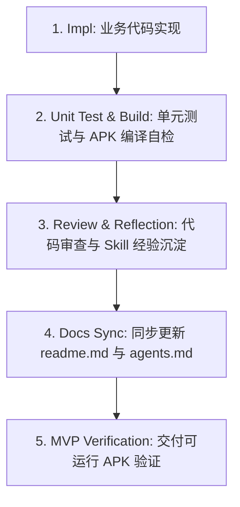

# Lingo English — 开发工作流与质量标准指南 (Development Workflow & Quality Guidelines)

本文档旨在规范 Lingo English 项目的开发流程、编码标准、测试要求与持续反思经验，确保每一阶段的交付物具备高度的可运行性与工程规范。

---

## 🔄 5 步质量开发工作流 (5-Step Quality Workflow)

每一个 Sprint 的功能开发与重构，必须严格遵守以下 5 个步骤：



### 1. 代码实现 (Implementation - `[Impl]`)
- **Clean Architecture 架构遵循**：按 `:domain`（纯业务/实体）、`:data`（数据源/网络/DB）、`:ui`（Compose 视图/组件）、`:app`（应用入口与 Hilt DI）分层。
- **英文代码注释**：根据基础编码规范，所有代码中的注释（类说明、方法 docstring、行内逻辑）**必须使用英文**。
- **AI 三通道统一配置**：LLM、TTS、ASR 服务共享 `SecureConfigPrefs` 中的 Base URL (`https://ark.cn-beijing.volces.com/api/plan`) 与 Auth Token，不硬编码第三方 SDK 依赖。

### 2. 自动化测试与编译自检 (Unit Test & Build - `[Unit Test & Build]`)
- **单元测试**：针对 Repository、ViewModel、规则引擎（如 Levenshtein 匹配算法、错题优先级计算）编写 JUnit 单元测试。
- **命令行自检**：在提交代码前，必须在 terminal 执行：
  ```cmd
  .\gradlew.bat test assembleDebug
  ```
- **零报错原则**：必须确保 `BUILD SUCCESSFUL`，不得带着编译报错或警告性崩溃进入下一步。

### 3. 代码审查与反思总结 (Review & Reflection - `[Review & Reflection]`)
- **边界条件审查**：检查空指针、网络断开、权限拒绝、内存泄漏等边缘场景。
- **反思与 Skill 沉淀**：总结开发中踩过的坑（如 JDK 版本兼容、Gradle 语法约束、Compose 重绘优化等），并记录到项目文档与 Skill 库中。

### 4. 文档同步更新 (Documentation Sync - `[Docs Sync]`)
- 每个 Sprint 结束时，必须同步更新以下项目主文档：
  - [readme.md](file:///d:/workbench/sandbox/english-learning-agent/readme.md)：更新架构关系图、镜像/编译说明。
  - [agents.md](file:///d:/workbench/sandbox/english-learning-agent/agents.md)：更新 Agent 时序图、系统 Prompt 模板。
  - [implementation_plan.md](file:///d:/workbench/sandbox/english-learning-agent/implementation_plan.md) & [task.md](file:///d:/workbench/sandbox/english-learning-agent/task.md)：更新 Sprint 完成状态。

### 5. 可运行 MVP 交付 (Runnable MVP Delivery - `[MVP Delivery]`)
- 每个 Sprint 必须交付一个可直接在 Android 手机或模拟器上安装运行的 MVP APK (`app-debug.apk`)，确保随时可以实测与验收。

---

## 🧠 经验与 Skill 沉淀 (Continuous Skill Reflections)

### 1. JDK & Gradle 兼容性 (JDK 21/25 & Gradle 8.13)
- **痛点**：JDK 25 中 Kotlin DSL 脚本解析器会抛出 `IllegalArgumentException: 25.0.3`。
- **规范**：开发环境统一使用完整 OpenJDK 21 (`D:\system\jdk21`)，其包含完整 `jlink.exe`，避免 AGP 在 `compileDebugJavaWithJavac` 时缺少 `jlink` 报错。

### 2. Version Catalog 语法约束
- **痛点**：`libs.versions.toml` 中带有减号 `-` 的依赖项（如 `glance-appwidget`），在 Kotlin DSL 中会被解析为减法运算符。
- **规范**：Kotlin DSL 脚本中统一使用点语法点分调用，如 `libs.glance.appwidget`。

### 3. Hilt Context 注入
- **痛点**：在 `:data` 模块中注入 `Context` 会导致 Dagger MissingBinding。
- **规范**：构造函数中注入 Application Context 必须显式标记 `@ApplicationContext context: Context`。
