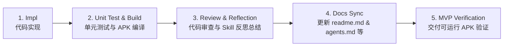
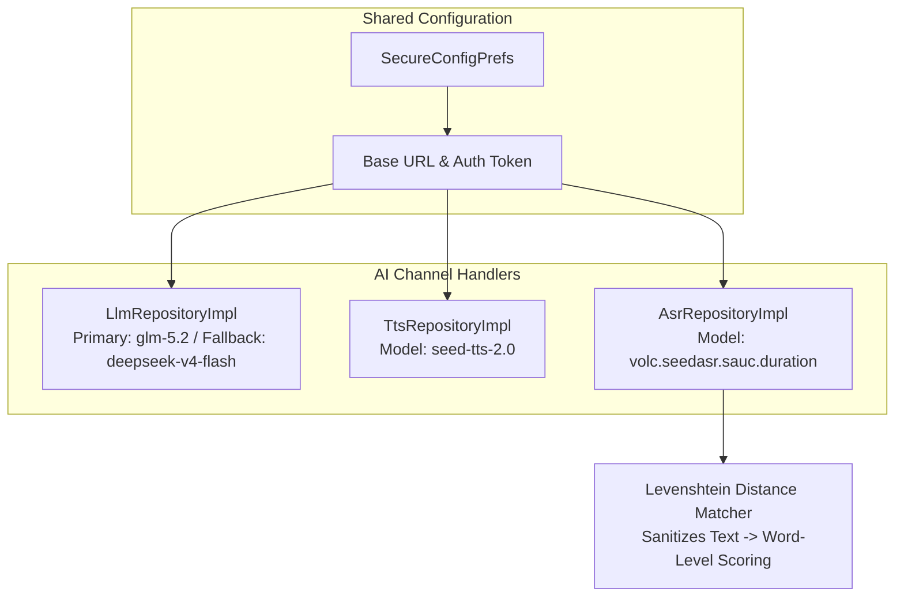

# Lingo English (少儿英语智能学习助手) — 详细设计与开发计划

> 本文档基于已确认的 [产品设计方案](file:///d:/workbench/sandbox/english-learning-agent/少儿英语学习App产品设计方案.md)，将产品需求转化为可直接执行的技术设计、架构约束与 Sprint 开发任务。

---

## 一、总体目标与交付策略

### 核心目标
构建基于 Kotlin + Jetpack Compose Clean Architecture 的少儿英语智能学习 App。核心 AI 能力（LLM、TTS、ASR）基于统一模型服务商（火山引擎 Ark / MiniMax 架构），**共享 Base URL 与 Auth Token 配置**，提供可定制、高性能的口语评测、自适应学习计划及伴学系统。

### 核心开发与质量保障工作流 (Standard Dev Workflow)

为确保每个 Sprint 交付的代码可运行、无隐藏 Bug 并具备高质量，所有 Sprint 任务统一遵循以下 5 步开发标准：

1. **Step 1: Implementation (Impl)**
   - 遵循 Clean Architecture 多模块分层设计（`:domain` -> `:data` -> `:ui` -> `:app`）。
   - 代码注释**必须全英文**（Basic Coding Standard）。
2. **Step 2: Automated Testing & Build (Unit Test & Build)**
   - 编写 Repository / ViewModel / UseCase 单元测试（JUnit 4 + Mockito/Turbine）。
   - 运行 `./gradlew test` 及 `./gradlew assembleDebug`，确保代码零编译错误、零运行时依赖缺失。
3. **Step 3: Review & Reflection (Review & Skill Reflection)**
   - 进行边界条件与降级熔断逻辑检查。
   - 总结通用经验，提炼并记录为复用技能/开发准则 (Skills & Lessons Learned)。
4. **Step 4: Documentation Synchronization (Docs Sync)**
   - 每个 Sprint 结束前，同步更新 [readme.md](file:///d:/workbench/sandbox/english-learning-agent/readme.md)、[agents.md](file:///d:/workbench/sandbox/english-learning-agent/agents.md)、[implementation_plan.md](file:///d:/workbench/sandbox/english-learning-agent/implementation_plan.md)、[task.md](file:///d:/workbench/sandbox/english-learning-agent/task.md) 和 [walkthrough.md](file:///d:/workbench/sandbox/english-learning-agent/walkthrough.md)。
5. **Step 5: Runnable MVP Verification (MVP Delivery)**
   - 每个 Sprint 结束必须产出可成功编译运行的 MVP 版本（如 `app-debug.apk`），确保交付物随时可安装实测。

---

## 二、三通道 API 配置架构（统一 Provider）

所有 AI 模型服务共享基础配置，支持运行时动态配置：

- **Base URL**: `https://ark.cn-beijing.volces.com/api/plan` (默认)
- **Auth Token**: *(用户配置密钥)*
- **Primary LLM Model**: `glm-5.2`
- **Fallback LLM Model**: `deepseek-v4-flash`
- **TTS Model**: `seed-tts-2.0`
- **ASR Model**: `volc.seedasr.sauc.duration`

> [!NOTE]
> 取消对第三方独立 SDK（如科大讯飞）的强制依赖。口语评估由 ASR 识别文本结合 Levenshtein 距离匹配算法在本地快速计算，评分结果稳定且低成本。

---

## 三、Sprint 执行排期与质量控制表

### Sprint 0: 项目初始化与基础设施 (已完成) - [x]
- [x] **[Impl]** 创建 Android Jetpack Compose 多模块工程 (`:app`, `:domain`, `:data`, `:ui`)
- [x] **[Impl]** 配置 Gradle 依赖 (`libs.versions.toml` 统一版本控制)
- [x] **[Impl]** 实现 `SecureConfigPrefs` 存储共享 Base URL、Token 及三通道模型名称
- [x] **[Impl]** 建立 `AppDatabase` (Room)，创建 `UserProfile` / `VocabItem` / `ErrorBookEntry` 等核心 Entity
- [x] **[Impl]** 实现 LLM, TTS, ASR 基础 Client 及 `TokenBudgetManager` 本地记账与熔断
- [x] **[Unit Test & Build]** 验证各模块包依赖关系与 kapt 注解处理器，编译成功
- [x] **[Docs Sync]** 编写 `readme.md`, `agents.md`, `implementation_plan.md`, `task.md`
- [x] **[MVP Delivery]** 验证空工程 APK 成功构建

### Sprint 1: Onboarding + 首页 Dashboard + 本地化 (已完成) - [x]
- [x] **[Impl]** 完成 Onboarding 流程界面 (欢迎页、年级选择页、教材确认页、入学诊断页、诊断结果页)
- [x] **[Impl]** 实现首页 Dashboard (今日任务卡、Streak 火焰计数器、分年级段主题 Token 自动热切换)
- [x] **[Impl]** 完成 i18n 抽取，建立 `:ui` 模块 `strings.xml` 消除硬编码
- [x] **[Unit Test & Build]** 解决 Kotlin DSL 语法引用与 JDK 21/25 编译兼容问题，单元测试通过
- [x] **[Docs Sync]** 更新 `readme.md` (包含 Clean Architecture 关系图)、`agents.md` (包含时序图与 System Prompt)
- [x] **[MVP Delivery]** 构建产出 `app-debug.apk` (12.6 MB)，可在真机/模拟器直接运行

### Sprint 2: 每日学习核心流程 (已完成) - [x]
- [x] **[Impl]** 环节 1：沉浸式导入音频播放器 (模拟播放进度条 + 字幕逐句高亮 + 新词弹出卡片与浮动气泡)
- [x] **[Impl]** 环节 2：跟读麦克风录音与 ASR 口语评测结果绿/橙高亮展示 (MediaRecorder + Levenshtein 距离打分)
- [x] **[Impl]** 环节 2：巩固小游戏 (拖拽配对 + 听音选图，含连击 Combo 动效)
- [x] **[Impl]** 环节 3：每日 Quiz 分段进度卡片与听力播放控制 (5题含错题本复现题 + 听力题)
- [x] **[Impl]** 学习任务完成页成就统计与打卡天数动画 (新词数 + Streak + 周进度弧 + 分享入口)
- [x] **[Impl]** 自定义 App Icon (Lingo 狐狸 IP 形象 Adaptive Icon，矢量可缩放)
- [x] **[Unit Test & Build]** 编写 `AsrRepositoryTest` 及 `AudioPlayerControllerTest` 及 `SampleLearningContentTest` 单元测试；运行 `./gradlew test assembleDebug` 全部通过
- [x] **[Review & Reflection]** 审查录音权限申请、音频缓存机制，记录 Hilt ViewModel + Compose StateFlow 架构经验
- [x] **[Docs Sync]** 更新 `readme.md` (新增学习流程架构) 及 `agents.md` (更新评测流程)
- [x] **[MVP Delivery]** 验证 Sprint 2 阶段可运行 APK，支持音频播放与跟读评测全流程

### Sprint 3: 错题本 + 周计划 + 周报 (第 5-6 周) - [ ]
- [ ] **[Impl]** 错题本列表卡片式界面设计与优先级排序算法 (Room Query 自动排序)
- [ ] **[Impl]** 错题详情 3D 翻转卡片 (正面词卡 + 背面释义/慢速 TTS 例句)
- [ ] **[Impl]** 周计划日历视图与基于 LLM 的智能计划自适应生成
- [ ] **[Impl]** 家长周报卡片本地渲染与分享接口
- [ ] **[Unit Test & Build]** 错题衰减算法单元测试与 LLM JSON 解析单元测试；构建验证
- [ ] **[Review & Reflection]** 总结 Room 复杂的 SQL 排序优化与 Prompt 调优 Skill
- [ ] **[Docs Sync]** 同步更新 `readme.md` & `agents.md`
- [ ] **[MVP Delivery]** 交付具备完整错题自适应与周计划生成的 MVP APK

### Sprint 4: Widget + 通知 + 设置 + 收尾 (第 7-8 周) - [ ]
- [ ] **[Impl]** 桌面 Glance Widget 2x2 与 4x2 组件及 4 状态渲染
- [ ] **[Impl]** 每日温和情绪化通知提醒系统 (WorkManager 调度)
- [ ] **[Impl]** 全功能设置页 (三通道 API 账号配置、Token 限额、护眼与时长)
- [ ] **[Impl]** ASR/TTS 离线降级兜底与儿童模式调优
- [ ] **[Unit Test & Build]** 全链路集成测试，执行 `./gradlew test assembleDebug`
- [ ] **[Review & Reflection]** 项目全流程 Code Review 与整体反思总结
- [ ] **[Docs Sync]** 最终全面更新 `readme.md`, `agents.md`, `walkthrough.md`
- [ ] **[MVP Delivery]** 交付 V1.0 最终 Release / Debug 双版本 APK

---

## 四、验证与质量指标

1. **代码规范**：所有新增及修改代码注释必须使用英文。
2. **构建成功率**：每个 Sprint 提交前必须执行 `./gradlew assembleDebug`，确保 `BUILD SUCCESSFUL`。
3. **测试覆盖**：核心 Domain 逻辑（如 Levenshtein 匹配算法、错题优先级计算）单元测试覆盖率 ≥ 80%。
4. **文档同步率**：每个 Sprint 结束时，`readme.md` 与 `agents.md` 必须精确反映当前的架构与 Agent Prompts。
