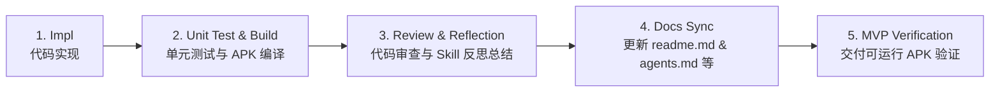
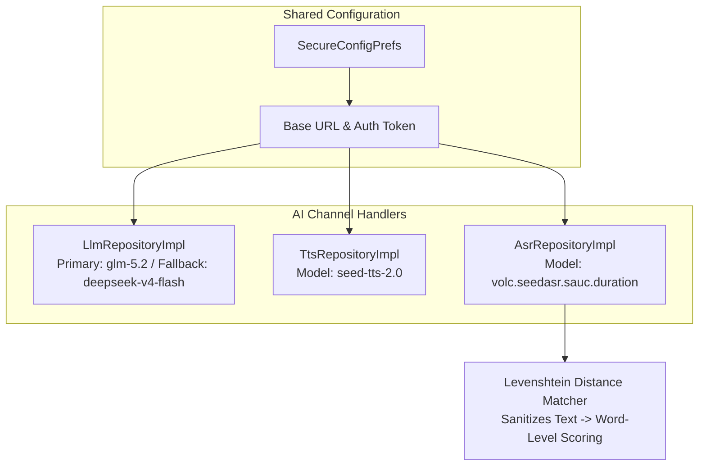

# Lingo English (少儿英语智能学习助手) — 详细设计与开发计划

> 本文档基于已确认的 [产品设计方案](file:///d:/workbench/sandbox/english-learning-agent/少儿英语学习App产品设计方案.md)，将产品需求转化为可直接执行的技术设计、架构约束与 Sprint 开发任务。

---

## 一、总体目标与交付策略

### 核心目标
构建基于 Kotlin + Jetpack Compose Clean Architecture 的少儿英语智能学习 App。核心 AI 能力（LLM、TTS、ASR）基于统一模型服务商（火山引擎 Ark / MiniMax 架构），**共享 Base URL 与 Auth Token 配置**，提供可定制、高性能的口语评测、自适应学习计划及伴学系统。

### 核心开发与质量保障工作流 (Standard Dev Workflow)

为确保每个 Sprint 交付的代码可运行、无隐藏 Bug 并具备高质量，所有 Sprint 任务统一遵循以下 5 步开发标准：

1. **Step 1: Implementation (Impl)**
   - 遵循 Clean Architecture 多模块分层设计（`:domain` -> `:data` -> `:ui` -> `:app`）。
   - 代码注释**必须全英文**（Basic Coding Standard）。
2. **Step 2: Automated Testing & Build (Unit Test & Build)**
   - 编写 Repository / ViewModel / UseCase 单元测试（JUnit 4 + Mockito/Turbine）。
   - 运行 `./gradlew test` 及 `./gradlew assembleDebug`，确保代码零编译错误、零运行时依赖缺失。
3. **Step 3: Review & Reflection (Review & Skill Reflection)**
   - 进行边界条件与降级熔断逻辑检查。
   - 总结通用经验，提炼并记录为复用技能/开发准则 (Skills & Lessons Learned)。
4. **Step 4: Documentation Synchronization (Docs Sync)**
   - 每个 Sprint 结束前，同步更新 [readme.md](file:///d:/workbench/sandbox/english-learning-agent/readme.md)、[agents.md](file:///d:/workbench/sandbox/english-learning-agent/agents.md)、[implementation_plan.md](file:///d:/workbench/sandbox/english-learning-agent/implementation_plan.md)、[task.md](file:///d:/workbench/sandbox/english-learning-agent/task.md) 和 [walkthrough.md](file:///d:/workbench/sandbox/english-learning-agent/walkthrough.md)。
5. **Step 5: Runnable MVP Verification (MVP Delivery)**
   - 每个 Sprint 结束必须产出可成功编译运行的 MVP 版本（如 `app-debug.apk`），确保交付物随时可安装实测。

---

## 二、三通道 API 配置架构（统一 Provider）

所有 AI 模型服务共享基础配置，支持运行时动态配置：

- **Base URL**: `https://ark.cn-beijing.volces.com/api/plan` (默认)
- **Auth Token**: *(用户配置密钥)*
- **Primary LLM Model**: `glm-5.2`
- **Fallback LLM Model**: `deepseek-v4-flash`
- **TTS Model**: `seed-tts-2.0`
- **ASR Model**: `volc.seedasr.sauc.duration`

> [!NOTE]
> 取消对第三方独立 SDK（如科大讯飞）的强制依赖。口语评估由 ASR 识别文本结合 Levenshtein 距离匹配算法在本地快速计算，评分结果稳定且低成本。

---

## 三、Sprint 执行排期与质量控制表

### Sprint 0: 项目初始化与基础设施 (已完成) - [x]
- [x] **[Impl]** 创建 Android Jetpack Compose 多模块工程 (`:app`, `:domain`, `:data`, `:ui`)
- [x] **[Impl]** 配置 Gradle 依赖 (`libs.versions.toml` 统一版本控制)
- [x] **[Impl]** 实现 `SecureConfigPrefs` 存储共享 Base URL、Token 及三通道模型名称
- [x] **[Impl]** 建立 `AppDatabase` (Room)，创建 `UserProfile` / `VocabItem` / `ErrorBookEntry` 等核心 Entity
- [x] **[Impl]** 实现 LLM, TTS, ASR 基础 Client 及 `TokenBudgetManager` 本地记账与熔断
- [x] **[Unit Test & Build]** 验证各模块包依赖关系与 kapt 注解处理器，编译成功
- [x] **[Docs Sync]** 编写 `readme.md`, `agents.md`, `implementation_plan.md`, `task.md`
- [x] **[MVP Delivery]** 验证空工程 APK 成功构建

### Sprint 1: Onboarding + 首页 Dashboard + 本地化 (已完成) - [x]
- [x] **[Impl]** 完成 Onboarding 流程界面 (欢迎页、年级选择页、教材确认页、入学诊断页、诊断结果页)
- [x] **[Impl]** 实现首页 Dashboard (今日任务卡、Streak 火焰计数器、分年级段主题 Token 自动热切换)
- [x] **[Impl]** 完成 i18n 抽取，建立 `:ui` 模块 `strings.xml` 消除硬编码
- [x] **[Unit Test & Build]** 解决 Kotlin DSL 语法引用与 JDK 21/25 编译兼容问题，单元测试通过
- [x] **[Docs Sync]** 更新 `readme.md` (包含 Clean Architecture 关系图)、`agents.md` (包含时序图与 System Prompt)
- [x] **[MVP Delivery]** 构建产出 `app-debug.apk` (12.6 MB)，可在真机/模拟器直接运行

### Sprint 2: 每日学习核心流程 (已完成) - [x]
- [x] **[Impl]** 环节 1：沉浸式导入音频播放器 (模拟播放进度条 + 字幕逐句高亮 + 新词弹出卡片与浮动气泡)
- [x] **[Impl]** 环节 2：跟读麦克风录音与 ASR 口语评测结果绿/橙高亮展示 (MediaRecorder + Levenshtein 距离打分)
- [x] **[Impl]** 环节 2：巩固小游戏 (拖拽配对 + 听音选图，含连击 Combo 动效)
- [x] **[Impl]** 环节 3：每日 Quiz 分段进度卡片与听力播放控制 (5题含错题本复现题 + 听力题)
- [x] **[Impl]** 学习任务完成页成就统计与打卡天数动画 (新词数 + Streak + 周进度弧 + 分享入口)
- [x] **[Impl]** 自定义 App Icon (Lingo 狐狸 IP 形象 Adaptive Icon，矢量可缩放)
- [x] **[Unit Test & Build]** 编写 `AsrRepositoryTest` 及 `AudioPlayerControllerTest` 及 `SampleLearningContentTest` 单元测试；运行 `./gradlew test assembleDebug` 全部通过
- [x] **[Review & Reflection]** 审查录音权限申请、音频缓存机制，记录 Hilt ViewModel + Compose StateFlow 架构经验
- [x] **[Docs Sync]** 更新 `readme.md` (新增学习流程架构) 及 `agents.md` (更新评测流程)
- [x] **[MVP Delivery]** 验证 Sprint 2 阶段可运行 APK，支持音频播放与跟读评测全流程

### Sprint 3: 错题本 + 周计划 + 周报 (已完成) - [x]
- [x] **[Impl]** 错题本列表卡片式界面设计与优先级排序算法 (Room Query 自动排序)
- [x] **[Impl]** 错题详情 3D 翻转卡片 (正面词卡 + 背面释义/慢速 TTS 例句)
- [x] **[Impl]** 周计划日历视图与基于 LLM 的智能计划自适应生成
- [x] **[Impl]** 家长周报卡片本地渲染与分享接口
- [x] **[Unit Test & Build]** 错题衰减算法单元测试与 LLM JSON 解析单元测试；构建验证
- [x] **[Review & Reflection]** 总结 Room 复杂的 SQL 排序优化与 Prompt 调优 Skill
- [x] **[Docs Sync]** 同步更新 `readme.md` & `agents.md`
- [x] **[MVP Delivery]** 交付具备完整错题自适应与周计划生成的 MVP APK

### Sprint 4: Widget + 通知 + 设置 + 收尾 (已完成) - [x]
- [x] **[Impl]** 桌面 Glance Widget 2x2 与 4x2 组件及 4 状态渲染
- [x] **[Impl]** 每日温和情绪化通知提醒系统 (WorkManager 调度)
- [x] **[Impl]** 全功能设置页 (三通道 API 账号配置、Token 限额、护眼与时长)
- [x] **[Impl]** ASR/TTS 离线降级兜底与儿童模式调优
- [x] **[Unit Test & Build]** 全链路集成测试，执行 `./gradlew test assembleDebug`
- [x] **[Review & Reflection]** 项目全流程 Code Review 与整体反思总结
- [x] **[Docs Sync]** 最终全面更新 `readme.md`, `agents.md`, `walkthrough.md`
- [x] **[MVP Delivery]** 交付 V1.0 最终 Release / Debug 双版本 APK

### Sprint 4.5: Bug Fix & UI Polish (已完成) - [x]
- [x] **[Impl]** 修复 Dashboard 底部卡片 (周计划/错题本) 布局不完整 — `AnimatedContent` 添加 `Modifier.fillMaxSize()`
- [x] **[Impl]** 修复入学诊断题始终相同 — 传递真实年级至 `DiagnosisViewModel`，Prompt 使用 `GradeBand` 适配难度，`maxTokens` 提升至 1500
- [x] **[Impl]** 修复 `DIAGNOSIS` 缺少 LLM 降级模板 — `LlmRepositoryImpl` 新增 10 题 JSON 兜底数据
- [x] **[Impl]** 修复 `LingoAvatar` 在小尺寸下耳朵被裁剪 — Canvas 绘制坐标按 `min(canvasW, canvasH) / 150f` 等比缩放
- [x] **[Impl]** 合并重复结果页 — 移除 `QuizResultPage`，Quiz 完成后直接进入 `TaskCompleteScreen`
- [x] **[Impl]** 移除 `GameOptionButton` 死代码参数 (`isThisSelected`/`isSelected`)
- [x] **[Impl]** 沉浸式音频接入真实 TTS — `LearningViewModel` 监听字幕索引变化，通过 `SystemTtsHelper` 逐句朗读
- [x] **[Impl]** 学习流程增加阶段间返回导航 — `goToPreviousStage()` 支持从 PRACTICE/QUIZ 返回上一阶段
- [x] **[Unit Test & Build]** 全模块编译通过 (`./gradlew :app:compileDebugKotlin`)

### Sprint 5: 弹性学习引擎与异常路径设计 (Resilient Learning Engine) - [ ]
> 设计原则：儿童使用场景下，学习流程会在无数个点被打断。本 Sprint 补齐状态机、断点续学、异常路径与情绪介入，使学习闭环真正具备可开发性与可测试性。

**Phase A: 学习任务状态机与断点续学**

- [ ] **[Impl]** 任务级状态机 (NOT_STARTED / IN_PROGRESS / PAUSED / COMPLETED / EXPIRED) - `LearningStage` 枚举增加 `PAUSED` 状态；`LearningViewModel` 监听 Activity 生命周期回调 (`onStop`) 自动进入 PAUSED；App 重启时检测 PAUSED 状态并恢复断点
- [ ] **[Impl]** 断点持久化到题/句子粒度 - `LearningRecordEntity` 新增 `checkpoint` JSON 字段 (记录 stage / phase / questionIndex / score)；`LearningViewModel` 在每次题目切换时写入 checkpoint；App 重启时从 Room 读取并恢复到精确位置
- [ ] **[Impl]** EXPIRED 任务次日补做机制 - 当日 23:59 仍未完成的任务标记为 EXPIRED；次日可在"未完成历史"中补做，但补做数据不计入当日 Streak（避免无限拖延心智）；非惩罚性文案："没关系，新的连续记录从今天开始！"

**Phase B: 跟读评测异常路径 (6 条分支)**

- [ ] **[Impl]** 录音时长 < 1 秒 (误触检测) - 不触发 ASR 调用，提示"好像没录上，再试一次？"，不计数为失败
- [ ] **[Impl]** 网络中断降级 - ASR 请求超时/失败时走已有离线降级 (`getOfflineFallbackResult`)，文案改为"这句先跟着读读看，我们晚点再打分"（不使用"网络错误"等技术术语）
- [ ] **[Impl]** 麦克风权限被拒绝 - 首次遇到时引导授权 (非强制)；拒绝后不重复弹窗，跟读环节降级为"仅听不读"，环节内小图标提示"点此开启跟读"
- [ ] **[Impl]** 连续 3 次重试同一句触发 Agent 介入 - Lingo 主动说"这句有点难，我们先跳过，明天再来挑战它"；自动跳过该句并记入 Error Book；需区分"认真练习"与"挫败循环"
- [ ] **[Bug]** 修复 `DiagnosisScreen.kt:426` 的 `dummy.wav` 问题 - 使用 `VoiceRecorder` 实际录音文件替代硬编码路径

**Phase C: 情绪状态介入机制**

- [ ] **[Impl]** `consecutive_negative_signal` 计数器 - 在 `LearningViewModel` 中追踪连续错误/重试/长时间无操作信号；达到阈值 (默认 3) 时触发环节级介入而非题目级介入
- [ ] **[Impl]** Lingo 情绪介入对话 - 触发时 Lingo 提议"要不要先休息一下，玩个不算分的小游戏？"；提供"休息"/"继续"/"跳过本环节"三选项；不算扣分

**Phase D: 已知 Bug 修复与硬编码清理**

- [ ] **[Bug]** 修复 `QuizScreen.kt` SPELL_FILL_BLANK 硬编码 "cla__room" - 改为从 `QuizQuestion` 数据动态渲染
- [ ] **[Bug]** 修复 `ErrorBookScreen.kt:104` 和 `ErrorBookDetailScreen.kt:40` 硬编码年级 - 从 `UserProfile` 读取真实年级
- [ ] **[Bug]** 修复 `DashboardViewModel.kt:61` 硬编码 "Buddy" - 从 `UserProfile` 读取孩子名字
- [ ] **[Bug]** 修复 `LearningViewModel.kt:478,491` 硬编码 `duration=900L` 和 `weeklyDayNumber=1` - 计算实际学习时长和从周计划读取天数
- [ ] **[Bug]** 修复 `TaskCompleteScreen.kt:206` "Share with parents" 空操作 - 实现分享功能 (生成学习摘要文本 + Intent.ACTION_SEND)
- [ ] **[Bug]** 添加 `domain/bin/` 到 `.gitignore`

**Phase E: 质量保障**

- [ ] **[Unit Test & Build]** 状态机转换测试、checkpoint 序列化/反序列化测试、异常路径覆盖测试；执行 `./gradlew test assembleDebug`
- [ ] **[Review & Reflection]** 总结儿童 App 弹性设计原则、断点续学在 Compose 中的最佳实践
- [ ] **[Docs Sync]** 更新 `readme.md` (状态机架构图), `agents.md` (情绪介入 Prompt), `implementation_plan.md`, `task.md`
- [ ] **[MVP Delivery]** 交付 V1.5 弹性学习引擎 APK，支持断点续学/异常路径/情绪介入

### Sprint 6: 教学法深化与 Agent 智能 (Pedagogical Deepening & Agent Intelligence) - [ ]
> 设计原则：在 Sprint 5 弹性基础设施之上，补齐教学法核心活动与 Agent 受限自主决策能力，使产品从"规则引擎 + 文案包装"进化为"真正理解孩子的智能伴学系统"。

**Phase A: 教学法核心活动**

- [ ] **[Impl]** 导入前词汇预热 (Pre-teach Vocab) - 已有 `PreTeachScreen` 基础，增加图片关联和 ESA Engage 互动设计
- [ ] **[Impl]** Listen-Repeat-Compare 循环 - TTS 自动播放示范 -> 录音 -> 回放对比 (播放孩子录音) -> ASR 评分 -> 可选重试，替代现有单向流程
- [ ] **[Impl]** PRIMARY 学段自然拼读 (Phonics Blending) - CVC 单词构建、声母韵母组合、最小对辨音
- [ ] **[Impl]** 间隔重复错题复现 - 在 Quiz 中按 Ebbinghaus 曲线 (1/3/7/14 天) 自动插入 Error Book 单词；复用已有 `nextReviewTimestamp` 字段
- [ ] **[Impl]** 产出型题目增强 - 完善 SPELLING/DICTATION 题型的评分逻辑 (已有题型枚举，需完善判定)；增加造句 (Sentence Writing) 题型

**Phase B: Agent 受限自主决策**

- [ ] **[Impl]** `DiagnoseAnomalyUseCase` - 归因子层：结构化学情摘要输入 -> 预定义分类输出 (考试压力/作息变化/动机减弱/难度不适配/无法判断) + 置信度；低置信度 (<0.6) 时不擅自决策，交还家长
- [ ] **[Impl]** `ExplainDecisionUseCase` - 可追问性：基于 `Plan` 表持久化的"生成依据"快照生成解释，而非重新调用 LLM 编理由；家长可在周计划页追问"为什么这周听力多一点？"
- [ ] **[Impl]** 错题本 Agent 追问 - 孩子在错题详情页可问"这个我怎么老是记不住？"，Agent 结合该词完整错误历史给出针对性解释 (复用 `ExplanationAgentUseCase` + ErrorBook 历史数据)

**Phase C: 游戏化与激励系统**

- [ ] **[Impl]** 奖励动画与 XP 系统 - 答题正确粒子特效、XP 弹出数字动画、Level Up 全屏庆祝页
- [ ] **[Impl]** 每日三目标系统 - 完成 1 次学习 / 正确率 ≥ 80% / 学习 5 个新词，每项独立追踪 + 徽章奖励
- [ ] **[Impl]** 提示/跳过系统完善 - 已有 3 级提示 (level 1 = LLM 生成)，增加跳过功能 (不扣分但不得 XP)

**Phase D: 自适应与家长报告**

- [ ] **[Impl]** 动态难度自适应 - 根据上一轮 Quiz 正确率调整下一轮 Sentence 长度 (±3 words) 与 CEFR 等级
- [ ] **[Impl]** 家长端详细学习报告 - 每词级发音错误细分、学习时长分布、薄弱技能标签云，支持 PDF/微信导出
- [ ] **[Impl]** 补签卡机制 - 每月 2 张补签卡，Streak 断裂时弹出主动选择 (非自动使用)，保留孩子对"我今天要不要学"的真实认知

**Phase E: 质量保障**

- [ ] **[Unit Test & Build]** 间隔重复算法测试、Phonics 模块测试、归因 Agent 测试、自适应难度测试；执行 `./gradlew test assembleDebug`
- [ ] **[Review & Reflection]** 总结 ESA 模型、受限自主 Agent 设计、间隔重复在移动端的最佳实践
- [ ] **[Docs Sync]** 全面更新所有文档反映 V2.0 架构
- [ ] **[MVP Delivery]** 交付 V2.0 教学法增强 + Agent 智能 APK

---

## 四、验证与质量指标

1. **代码规范**：所有新增及修改代码注释必须使用英文。
2. **构建成功率**：每个 Sprint 提交前必须执行 `./gradlew assembleDebug`，确保 `BUILD SUCCESSFUL`。
3. **测试覆盖**：核心 Domain 逻辑（如 Levenshtein 匹配算法、错题优先级计算）单元测试覆盖率 ≥ 80%。
4. **文档同步率**：每个 Sprint 结束时，`readme.md` 与 `agents.md` 必须精确反映当前的架构与 Agent Prompts。
