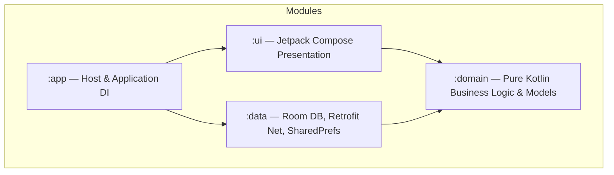
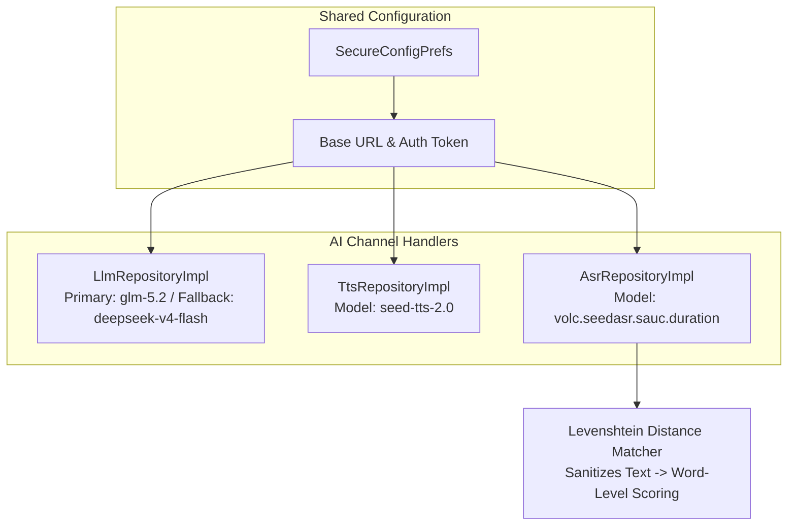

# Lingo English (少儿英语智能学习助手) — 方案设计与技术架构

> 本文档为 App 的**核心技术架构与方案设计规范**。具体的逐项 Task 开发清单请参考 [task.md](file:///d:/workbench/sandbox/english-learning-agent/task.md)。

---

## 一、总体目标与交付策略

### 核心目标
构建基于 Kotlin + Jetpack Compose Clean Architecture 的少儿英语智能学习 App。核心 AI 能力（LLM、TTS、ASR）基于统一模型服务商（火山引擎 Ark / MiniMax 架构），**共享 Base URL 与 Auth Token 配置**，提供可定制、高性能的口语评测、自适应学习计划及伴学系统。

### Clean Architecture 多模块分层设计


- **`:domain`**: 零框架依赖，纯 Kotlin 实体（`UserProfile`, `VocabItem`, `LearningSession`）与 Repository 接口声明。
- **`:data`**: 本地持久化 (Room DB)、网络层 (Retrofit) 与共享配置 (`SecureConfigPrefs`)，实现 `:domain` 声明的接口。
- **`:ui`**: Jetpack Compose 视图层、响应式状态管理 (`StateFlow`) 与自定义动画组件 (`LingoAvatar`)。
- **`:app`**: 宿主模块，Hilt 依赖注入总入口与 Navigation 路由状态机。

---

## 二、AI 通道架构（统一 Provider）

所有 AI 模型服务共享基础配置，支持运行时动态配置：

- **Base URL**: `https://ark.cn-beijing.volces.com/api/plan/v3` (默认)
- **Auth Token**: *(用户配置密钥)*
- **Primary LLM**: `glm-5.2` | **Fallback LLM**: `deepseek-v4-flash`
- **TTS Model**: `seed-tts-2.0` | **ASR Model**: `volc.seedasr.sauc.duration`



---

## 三、Roadmap 概览与版本演进 (Sprints 0–19)

| 版本 | Sprint | 核心主题 | 状态 |
|---|---|---|---|
| **v1.0** | Sprints 0–4 | 基础骨架、Onboarding、Dashboard、ESA 核心流程、错题本、Widget与提醒 | 已发布 ✅ |
| **v1.5** | Sprint 5 | 弹性学习引擎 (状态机、断点续学、异常路径、情绪介入) | 已发布 ✅ |
| **v1.6** | Sprint 6 | AI 存在感显性化 (AgentDecisionLog、过程观察气泡、解释依据、AI 成长笔记) | 已发布 ✅ |
| **v2.0** | Sprint 7 | 教学法深化与 Agent 智能 (PreTeach Engage、Phonics、归因 Agent、补签卡) | 已发布 ✅ |
| **v3.0** | Sprints 10–14 | 可见成长、伴学升级 (Roleplay 2.0)、真实音频沉浸 (TTS 接入)、自适应小组件 | 已发布 ✅ |
| **v3.5** | Sprint 15 | 语音评测 API、耻感消除颜色、挫败感检测引擎、人教版对齐、Mate 80 适配 | 已发布 ✅ |
| **v4.0** | Sprint 16 | 商业化合规与病毒增长 (Freemium 30 节门槛、护眼模式、语音成长档案、每日成就卡) | 已发布 ✅ |
| **v4.1** | Sprint 17 | UX 精品化与情感联结 (Dashboard 骨架屏、Lingo 见面页、微庆祝、词汇清单、记忆泡泡) | 已发布 ✅ |
| **v4.2** | Sprint 18 | 智能化与 PEP 考试复习 (错题本观察期贯通、PEP 单元测验、自适应时长、睡前故事) | 已发布 ✅ |
| **v4.3** | Sprint 19 | 流利度突破与离线韧性 (影子跟读、离线包、中级挑战轨道、CEFR 映射、成长报告) | 已发布 ✅ |
| **v4.4** | Sprint 20 | 核心用户路径重构 (首次 Key 门槛、直通 AI 计划生成、文本自动缩放排版、错题本写入修复、TTS 声音修复) | **规划中 🔴** |

---

## 四、Sprint 19 & 20 核心技术设计

### Sprint 19 核心技术设计 (v4.3.0) — 已交付 ✅
1. **影子跟读模式 "Shadow the Fox" `[P0]`**: `PracticeScreen` 新增 `Shadow Mode` 切换与 `3-2-1` 倒计时同步跟读，`VoiceRecorder` 增加 `shadowDelayMs` 参数。
2. **离线内容包 `[P1]`**: 预置 5 套离线 JSON Session（`res/raw/`），无网自动降级加载，Dashboard 呈现 "📶 Offline Mode"。
3. **中级 "挑战轨道" `[P1]`**: 为 30+ 会话/C 级儿童开启 B1 级别词汇与长句挑战。
4. **CEFR 国际等级指示器 `[P2]`**: `CefrMapper.kt` 映射并在 Dashboard / WeeklyReport 标注。
5. **可打印英语成长报告单 `[P2]`**: `ReportCardScreen.kt` 导出 A4 PNG 报告单。

---

### Sprint 20 核心技术设计 (v4.4.0) — ✅ 已交付

#### 1. 首次启动 Key 配置门槛 (`ModelConfigGateScreen.kt`) `[P0]`
- App 启动与 Onboarding 诊断开始前，检测 `prefs.getAuthToken()`。若未配置，阻断并展示 ModelConfigGate 界面，引导配置 Key/Base URL 并成功测试后才开始真实诊断与建计划。

#### 2. Onboarding 结束直通 AI 计划生成 (`PlanGeneratingScreen.kt`) `[P0]`
- 诊断结果页点击 "生成我的 AI 计划 🪄" 直通 `PlanGeneratingScreen`（展示真实 LLM 生成进度），生成后进 Dashboard；Dashboard 无计划时展示 "🪄 开启我的周计划" CTA 卡片。

#### 3. 学习流程文本自适应排版 (`AutoResizeText.kt`) `[P0]`
- 封装 `AutoResizeText` composable（根据容器宽度在 16sp~26sp 间动态缩放，允许换行与 Ellipsis 截断处理），彻底解决 PreTeach 闪卡、Practice 句子框与 Quiz 在 Mate 80 等屏幕下的单词/句子截断和非正常换行。

#### 4. 错题本错题落库与展示修复 `[P0]`
- 规范 `LearningViewModel` 错词 `vocabId` 提取算法（取真实单词非 `vocab_123` 或整句）；确保 Quiz / Game 错题与口语低分 100% `upsertError` 写入 Room；`ErrorBookScreen` 具备 `onResume` 自动刷新能力。

#### 5. TTS 音频合成 Payload 与无声提示修复 `[P0]`
- 更新 `TtsRepositoryImpl` Payload 兼容火山引擎 Ark / OpenAI 格式 (`/audio/tts`)；`SystemTtsHelper` 发生 `LANG_MISSING_DATA` 或合成失败时，统一通过 Snackbar 明确提示："⚠️ 设备的英文发音引擎未就绪，请配置 API Key 或安装 TTS 语音包"，告别无声静默。


---

## 五、质量保障工作流 (5-Gate Pipeline)

所有 Sprint 代码合并与 Release 提交必须通过以下 5 关验证：

```
Gate 1 (Build)     → ./gradlew.bat assembleDebug        → 零编译错误
Gate 2 (Tests)     → ./gradlew.bat test                 → 100% 单元测试通过
Gate 3 (Arch)      → :domain 模块无 android.* 依赖       → 干净架构隔离
Gate 4 (UX Flow)   → 真机/模拟器全流程走通               → 零崩溃无卡顿
Gate 5 (Release)   → ./gradlew.bat assembleRelease       → 签名 APK < 12MB
```
