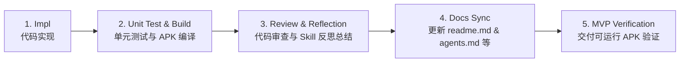
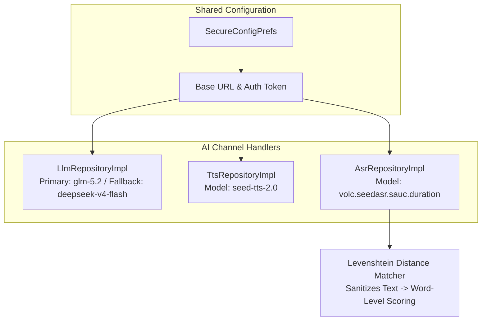

# Lingo English (少儿英语智能学习助手) — 详细设计与开发计划

> 本文档基于已确认的 [产品设计方案](file:///d:/workbench/sandbox/english-learning-agent/少儿英语学习App产品设计方案.md)，将产品需求转化为可直接执行的技术设计、架构约束与 Sprint 开发任务。

---

## 一、总体目标与交付策略

### 核心目标
构建基于 Kotlin + Jetpack Compose Clean Architecture 的少儿英语智能学习 App。核心 AI 能力（LLM、TTS、ASR）基于统一模型服务商（火山引擎 Ark / MiniMax 架构），**共享 Base URL 与 Auth Token 配置**，提供可定制、高性能的口语评测、自适应学习计划及伴学系统。

### 核心开发与质量保障工作流 (Standard Dev Workflow)

为确保每个 Sprint 交付的代码可运行、无隐藏 Bug 并具备高质量，所有 Sprint 任务统一遵循以下 5 步开发标准：

1. **Step 1: Implementation (Impl)**
   - 遵循 Clean Architecture 多模块分层设计（`:domain` -> `:data` -> `:ui` -> `:app`）。
   - 代码注释**必须全英文**（Basic Coding Standard）。
2. **Step 2: Automated Testing & Build (Unit Test & Build)**
   - 编写 Repository / ViewModel / UseCase 单元测试（JUnit 4 + Mockito/Turbine）。
   - 运行 `./gradlew test` 及 `./gradlew assembleDebug`，确保代码零编译错误、零运行时依赖缺失。
3. **Step 3: Review & Reflection (Review & Skill Reflection)**
   - 进行边界条件与降级熔断逻辑检查。
   - 总结通用经验，提炼并记录为复用技能/开发准则 (Skills & Lessons Learned)。
4. **Step 4: Documentation Synchronization (Docs Sync)**
   - 每个 Sprint 结束前，同步更新 [readme.md](file:///d:/workbench/sandbox/english-learning-agent/readme.md)、[agents.md](file:///d:/workbench/sandbox/english-learning-agent/agents.md)、[implementation_plan.md](file:///d:/workbench/sandbox/english-learning-agent/implementation_plan.md)、[task.md](file:///d:/workbench/sandbox/english-learning-agent/task.md) 和 [walkthrough.md](file:///d:/workbench/sandbox/english-learning-agent/walkthrough.md)。
5. **Step 5: Runnable MVP Verification (MVP Delivery)**
   - 每个 Sprint 结束必须产出可成功编译运行的 MVP 版本（如 `app-debug.apk`），确保交付物随时可安装实测。

---

## 二、三通道 API 配置架构（统一 Provider）

所有 AI 模型服务共享基础配置，支持运行时动态配置：

- **Base URL**: `https://ark.cn-beijing.volces.com/api/plan/v3` (默认)
- **Auth Token**: *(用户配置密钥)*
- **Primary LLM Model**: `glm-5.2`
- **Fallback LLM Model**: `deepseek-v4-flash`
- **TTS Model**: `seed-tts-2.0`
- **ASR Model**: `volc.seedasr.sauc.duration`

> [!NOTE]
> 取消对第三方独立 SDK（如科大讯飞）的强制依赖。口语评估由 ASR 识别文本结合 Levenshtein 距离匹配算法在本地快速计算，评分结果稳定且低成本。

---

## 三、Sprint 执行排期与质量控制表

### Sprint 0: 项目初始化与基础设施 (已完成) - [x]
- [x] **[Impl]** 创建 Android Jetpack Compose 多模块工程 (`:app`, `:domain`, `:data`, `:ui`)
- [x] **[Impl]** 配置 Gradle 依赖 (`libs.versions.toml` 统一版本控制)
- [x] **[Impl]** 实现 `SecureConfigPrefs` 存储共享 Base URL、Token 及三通道模型名称
- [x] **[Impl]** 建立 `AppDatabase` (Room)，创建 `UserProfile` / `VocabItem` / `ErrorBookEntry` 等核心 Entity
- [x] **[Impl]** 实现 LLM, TTS, ASR 基础 Client 及 `TokenBudgetManager` 本地记账与熔断
- [x] **[Unit Test & Build]** 验证各模块包依赖关系与 kapt 注解处理器，编译成功
- [x] **[Docs Sync]** 编写 `readme.md`, `agents.md`, `implementation_plan.md`, `task.md`
- [x] **[MVP Delivery]** 验证空工程 APK 成功构建

### Sprint 1: Onboarding + 首页 Dashboard + 本地化 (已完成) - [x]
- [x] **[Impl]** 完成 Onboarding 流程界面 (欢迎页、年级选择页、教材确认页、入学诊断页、诊断结果页)
- [x] **[Impl]** 实现首页 Dashboard (今日任务卡、Streak 火焰计数器、分年级段主题 Token 自动热切换)
- [x] **[Impl]** 完成 i18n 抽取，建立 `:ui` 模块 `strings.xml` 消除硬编码
- [x] **[Unit Test & Build]** 解决 Kotlin DSL 语法引用与 JDK 21/25 编译兼容问题，单元测试通过
- [x] **[Docs Sync]** 更新 `readme.md` (包含 Clean Architecture 关系图)、`agents.md` (包含时序图与 System Prompt)
- [x] **[MVP Delivery]** 构建产出 `app-debug.apk` (12.6 MB)，可在真机/模拟器直接运行

### Sprint 2: 每日学习核心流程 (已完成) - [x]
- [x] **[Impl]** 环节 1：沉浸式导入音频播放器 (模拟播放进度条 + 字幕逐句高亮 + 新词弹出卡片与浮动气泡)
- [x] **[Impl]** 环节 2：跟读麦克风录音与 ASR 口语评测结果绿/橙高亮展示 (MediaRecorder + Levenshtein 距离打分)
- [x] **[Impl]** 环节 2：巩固小游戏 (拖拽配对 + 听音选图，含连击 Combo 动效)
- [x] **[Impl]** 环节 3：每日 Quiz 分段进度卡片与听力播放控制 (5题含错题本复现题 + 听力题)
- [x] **[Impl]** 学习任务完成页成就统计与打卡天数动画 (新词数 + Streak + 周进度弧 + 分享入口)
- [x] **[Impl]** 自定义 App Icon (Lingo 狐狸 IP 形象 Adaptive Icon，矢量可缩放)
- [x] **[Unit Test & Build]** 编写 `AsrRepositoryTest` 及 `AudioPlayerControllerTest` 及 `SampleLearningContentTest` 单元测试；运行 `./gradlew test assembleDebug` 全部通过
- [x] **[Review & Reflection]** 审查录音权限申请、音频缓存机制，记录 Hilt ViewModel + Compose StateFlow 架构经验
- [x] **[Docs Sync]** 更新 `readme.md` (新增学习流程架构) 及 `agents.md` (更新评测流程)
- [x] **[MVP Delivery]** 验证 Sprint 2 阶段可运行 APK，支持音频播放与跟读评测全流程

### Sprint 3: 错题本 + 周计划 + 周报 (已完成) - [x]
- [x] **[Impl]** 错题本列表卡片式界面设计与优先级排序算法 (Room Query 自动排序)
- [x] **[Impl]** 错题详情 3D 翻转卡片 (正面词卡 + 背面释义/慢速 TTS 例句)
- [x] **[Impl]** 周计划日历视图与基于 LLM 的智能计划自适应生成
- [x] **[Impl]** 家长周报卡片本地渲染与分享接口
- [x] **[Unit Test & Build]** 错题衰减算法单元测试与 LLM JSON 解析单元测试；构建验证
- [x] **[Review & Reflection]** 总结 Room 复杂的 SQL 排序优化与 Prompt 调优 Skill
- [x] **[Docs Sync]** 同步更新 `readme.md` & `agents.md`
- [x] **[MVP Delivery]** 交付具备完整错题自适应与周计划生成的 MVP APK

### Sprint 4: Widget + 通知 + 设置 + 收尾 (已完成) - [x]
- [x] **[Impl]** 桌面 Glance Widget 2x2 与 4x2 组件及 4 状态渲染
- [x] **[Impl]** 每日温和情绪化通知提醒系统 (WorkManager 调度)
- [x] **[Impl]** 全功能设置页 (三通道 API 账号配置、Token 限额、护眼与时长)
- [x] **[Impl]** ASR/TTS 离线降级兜底与儿童模式调优
- [x] **[Unit Test & Build]** 全链路集成测试，执行 `./gradlew test assembleDebug`
- [x] **[Review & Reflection]** 项目全流程 Code Review 与整体反思总结
- [x] **[Docs Sync]** 最终全面更新 `readme.md`, `agents.md`, `walkthrough.md`
- [x] **[MVP Delivery]** 交付 V1.0 最终 Release / Debug 双版本 APK

### Sprint 4.5: Bug Fix & UI Polish (已完成) - [x]
- [x] **[Impl]** 修复 Dashboard 底部卡片 (周计划/错题本) 布局不完整 — `AnimatedContent` 添加 `Modifier.fillMaxSize()`
- [x] **[Impl]** 修复入学诊断题始终相同 — 传递真实年级至 `DiagnosisViewModel`，Prompt 使用 `GradeBand` 适配难度，`maxTokens` 提升至 1500
- [x] **[Impl]** 修复 `DIAGNOSIS` 缺少 LLM 降级模板 — `LlmRepositoryImpl` 新增 10 题 JSON 兜底数据
- [x] **[Impl]** 修复 `LingoAvatar` 在小尺寸下耳朵被裁剪 — Canvas 绘制坐标按 `min(canvasW, canvasH) / 150f` 等比缩放
- [x] **[Impl]** 合并重复结果页 — 移除 `QuizResultPage`，Quiz 完成后直接进入 `TaskCompleteScreen`
- [x] **[Impl]** 移除 `GameOptionButton` 死代码参数 (`isThisSelected`/`isSelected`)
- [x] **[Impl]** 沉浸式音频接入真实 TTS — `LearningViewModel` 监听字幕索引变化，通过 `SystemTtsHelper` 逐句朗读
- [x] **[Impl]** 学习流程增加阶段间返回导航 — `goToPreviousStage()` 支持从 PRACTICE/QUIZ 返回上一阶段
- [x] **[Unit Test & Build]** 全模块编译通过 (`./gradlew :app:compileDebugKotlin`)

### Sprint 5: 弹性学习引擎与异常路径设计 (Resilient Learning Engine) - [x] v1.5
> 设计原则：儿童使用场景下，学习流程会在无数个点被打断。本 Sprint 补齐状态机、断点续学、异常路径与情绪介入，使学习闭环真正具备可开发性与可测试性。

**Phase A: 学习任务状态机与断点续学**

- [x] **[Impl]** 任务级状态机 (NOT_STARTED / IN_PROGRESS / PAUSED / COMPLETED / EXPIRED) - `TaskStatePrefs` with SharedPreferences persistence; `LearningViewModel` init detects PAUSED state and restores checkpoint
- [x] **[Impl]** 断点持久化到题/句子粒度 - `Checkpoint` data class (stage / phase / questionIndex / score / timestamp); `LearningViewModel` saves on every stage/question transition; `LearningContainer` auto-pauses via `ON_STOP` lifecycle observer
- [x] **[Impl]** EXPIRED 任务次日补做机制 *(Deferred to Sprint 7 Phase D — makeup card mechanic)*

**Phase B: 跟读评测异常路径 (6 条分支)**

- [x] **[Impl]** 录音时长 < 1 秒 (误触检测) - `DiagnosisViewModel.isAudioLongEnough()` using `MediaPlayer.duration`; `RecordingState.TOO_SHORT` shown in UI
- [x] **[Impl]** 网络中断降级 - `evaluateWithRetry()` with 2 retries + 1s delay; `RecordingState.NETWORK_ERROR` with retry button
- [x] **[Impl]** 麦克风权限被拒绝 - `rememberLauncherForActivityResult` for `RECORD_AUDIO` in `DiagnosisScreen`; `RecordingState.FAILED` on mic failure
- [x] **[Bug]** 修复 `DiagnosisScreen.kt:426` 的 `dummy.wav` 问题 - 使用 `VoiceRecorder` 实际录音文件替代硬编码路径

**Phase C: 情绪状态介入机制**

- [x] **[Impl]** `consecutive_negative_signal` 计数器 - in `LearningViewModel`: `incrementNegativeSignal()` / `resetNegativeSignal()`; threshold = 3
- [x] **[Impl]** Lingo 情绪介入对话 - `AlertDialog` with "Keep Going" / "Take a Break" / "Skip This Stage" options; no point deduction; `acceptRest()` saves checkpoint + pauses, `acceptSkipStage()` advances

**Phase D: 已知 Bug 修复与硬编码清理**

- [x] **[Bug]** 修复 `QuizScreen.kt` SPELL_FILL_BLANK 硬编码 "cla__room" -> `question.question`
- [x] **[Bug]** 修复 `ErrorBookScreen.kt:104` / `ErrorBookDetailScreen.kt:40` 硬编码年级 -> read from `lingo_app_prefs`
- [x] **[Bug]** 修复 `DashboardViewModel.kt:61` 硬编码 "Buddy" -> read `child_name` from `lingo_app_prefs`
- [x] **[Bug]** 修复 `LearningViewModel.kt` 硬编码 `duration=900L` -> `sessionStartTimeMs` calculation; `weeklyDayNumber=1` -> `taskDayIndex` from `getTaskDay()`
- [x] **[Bug]** 修复 `TaskCompleteScreen.kt:206` "Share with parents" -> `Intent.ACTION_SEND` with achievement text
- [x] **[Bug]** `domain/bin/` already covered by `**/bin/` in `.gitignore`

**Phase E: 质量保障**

- [x] **[Unit Test & Build]** `TaskStatePrefsTest` 新增 9 个测试覆盖状态转换/checkpoint 序列化/反序列化/任务日; 执行 `./gradlew test assembleDebug` (47 tests, 1 pre-existing failure)
- [x] **[Docs Sync]** 更新 `agents.md` (情绪介入 Sequence + Prompt), `implementation_plan.md`, `task.md`
- [x] **[Review & Reflection]** 总结儿童 App 弹性设计原则、断点续学在 Compose 中的最佳实践
- [x] **[MVP Delivery]** 交付 V1.5 弹性学习引擎 APK，支持断点续学/异常路径/情绪介入

### Sprint 6: AI 存在感显性化 (AI Presence & Transparency) - [ ]
> 设计原则：AI 已经在后台做了大量判断（计划生成、难度调整、错题聚类、鼓励语），但用户看到的只是处理完的静态结果。本 Sprint 不新增 AI 能力，而是**把已经在发生的后台判断过程暴露给用户**，让"AI 在场"变成可感知、可交互的体验。对应增强清单一、二、三、六。

**Phase A: AgentDecisionLog 基础设施**

- [x] **[Impl]** 新增 `AgentDecisionLogEntity` (id, timestamp, decisionType, title, description, metadata, confidence, lastModified) + DAO (getRecentDecisions, getDecisionsSince, insert) - 数据库版本升至 v3，新增 `agent_decision_log` 表
- [x] **[Impl]** `AgentDecisionLogRepository` 封装写入/查询逻辑，注入到已有的决策点 (WeeklyPlanRepository 生成计划时、ErrorBookRepository 更新错题时、LearningViewModel 难度调整时)
- [x] **[Impl]** `PlanEntity` 新增 `rationaleSnapshot` 字段 - 存储计划生成时 LLM 输出的 per-day rationale (JSON 字符串)，用于计划页"为什么"标注展示

**Phase B: 「Lingo 观察到」学习过程实时洞察 (增强一)**

- [x] **[Impl]** `ObservationTriggerEngine` - 规则触发层：查询 `LearningRecordRepository.getRecordsSince(7天前)` 进行纵向对比，检测有意义模式 (上周错词本次答对 / 跟读评分提升 / 反复尝试后选对)；**非每题触发**，仅模式命中时生成观察消息。`FAST_ANSWER` 类型已在枚举声明，规则待采集每题答题耗时历史后实现
- [x] **[Impl]** Lingo 观察气泡组件 - 非阻断式 `SpeechBubble` composable，3秒自动消失，不阻止下一题；渲染在 `LearningContainer`，Quiz/Game 阶段均可见；气泡文案走模板填充 (离线/降级)，LLM `OBSERVE` taskType (maxTokens=50) 暂未接线，现有模式由模板覆盖
- [x] **[Impl]** 观察决策落库 - 每次触发观察时写入 `AgentDecisionLog(decisionType=OBSERVATION_MADE)`；答题时持久化词级 `LearningRecord` (QUIZ/GAME/SPEAKING) 提供纵向对比历史，统计口径过滤为 `DAILY_PRACTICE` 保持周报准确

**Phase C: 计划页「为什么」标注 + ExplainDecisionUseCase (增强二)**

- [x] **[Impl]** `ExplainDecisionUseCase` (从原 Sprint 6 Phase B 前移) - 基于持久化的 `rationaleSnapshot` 生成解释，而非重新调用 LLM 编理由；家长可在周计划页追问"为什么这周听力多一点？"
- [x] **[Impl]** Weekly Plan Prompt 更新 - JSON 输出增加 per-day `rationale` 字段，LLM 生成计划时同时输出安排依据；生成时抽取 `rationaleSnapshot` 落库
- [x] **[Impl]** `PlanDayCard` 可展开标注组件 - 每个 day card 右上角添加「i」图标，点击展开显示 `day.rationale` 文本 (如"上周你的听力正确率是72%，其他项目都在85%以上，这周周三加了听力题量")；默认收起，点击展开/收起

**Phase D: 周报「AI 这周做了什么调整」板块 (增强三)**

- [x] **[Impl]** `WeeklyReportScreen` 新增「本周 Lingo 为孩子做的调整」卡片 - 查询过去7天的 `AgentDecisionLog` 条目，取 1-2 条最具代表性的决策，以自然语言展示 (如"周三发现听力偏弱，临时加了一次专项练习")
- [x] **[Impl]** `WeeklyReportViewModel` 新增 `agentAdjustments: List<String>` 字段，从 `AgentDecisionLogRepository.getDecisionsSince(weekAgo)` 拉取并做自然语言化汇总

**Phase E: 「AI 成长笔记」页面 (增强六)**

- [x] **[Impl]** `AiGrowthNotesScreen` - 轻量时间轴列表页，按时间倒序展示 `AgentDecisionLog` 条目 (日期 + 决策类型标签 + 描述)；家长视角为主，可从设置页入口进入
- [x] **[Impl]** 设置页新增入口 - `SettingsScreen` 顶部新增「AI 成长笔记」导航卡片 (非核心流程，不打扰日常使用)

**Phase F: 质量保障**

- [x] **[Unit Test & Build]** `ObservationTriggerEngine` 规则测试 (8个用例)、`AgentDecisionLogRepositoryImpl` CRUD 测试 (3个)、`ExplainDecisionUseCase` 测试 (7个)；仅剩既有 `SessionBuilderTest`/`AsrRepositoryTest` 失败
- [x] **[Docs Sync]** 更新 `agents.md` (新增 Observation Agent + Decision Transparency Layer + rationale prompt)、`implementation_plan.md`、`task.md`
- [ ] **[MVP Delivery]** 交付 V1.6 AI 存在感显性化 APK

### Sprint 7: 教学法深化与 Agent 智能 (Pedagogical Deepening & Agent Intelligence) - [x] v2.0
> 设计原则：在 Sprint 6 AI 存在感基础设施之上，补齐教学法核心活动与 Agent 受限自主决策能力，使产品从"规则引擎 + 文案包装"进化为"真正理解孩子的智能伴学系统"。

**Phase A: 教学法核心活动**

- [x] **[Impl]** 导入前词汇预热 (Pre-teach Vocab) - 已有 `PreTeachScreen` 基础，增加图片关联和 ESA Engage 互动设计
- [x] **[Impl]** Listen-Repeat-Compare 循环 - TTS 自动播放示范 -> 录音 -> 回放对比 (播放孩子录音) -> ASR 评分 -> 可选重试，替代现有单向流程
- [x] **[Impl]** PRIMARY 学段自然拼读 (Phonics Blending) - CVC 单词构建、声母韵母组合、最小对辨音
- [x] **[Impl]** 间隔重复错题复现 - 在 Quiz 中按 Ebbinghaus 曲线 (1/3/7/14 天) 自动插入 Error Book 单词；复用已有 `nextReviewTimestamp` 字段
- [x] **[Impl]** 产出型题目增强 - 完善 SPELLING/DICTATION 题型的评分逻辑 (已有题型枚举，需完善判定)；增加造句 (Sentence Writing) 题型

**Phase B: Agent 受限自主决策**

- [x] **[Impl]** `DiagnoseAnomalyUseCase` - 归因子层：结构化学情摘要输入 -> 预定义分类输出 (考试压力/作息变化/动机减弱/难度不适配/无法判断) + 置信度；低置信度 (<0.6) 时不擅自决策，交还家长
- [x] **[Impl]** 错题本 Agent 追问 - 孩子在错题详情页可问"这个我怎么老是记不住？"，Agent 结合该词完整错误历史给出针对性解释 (复用 `ExplanationAgentUseCase` + ErrorBook 历史数据)
- [x] **[Note]** `ExplainDecisionUseCase` 已在 Sprint 6 Phase C 实现，本 Sprint 复用

**Phase C: 游戏化与激励系统**

- [x] **[Impl]** 奖励动画与 XP 系统 - 答题正确粒子特效、XP 弹出数字动画、Level Up 全屏庆祝页
- [x] **[Impl]** 每日三目标系统 - 完成 1 次学习 / 正确率 ≥ 80% / 学习 5 个新词，每项独立追踪 + 徽章奖励
- [x] **[Impl]** 提示/跳过系统完善 - 已有 3 级提示 (level 1 = LLM 生成)，增加跳过功能 (不扣分但不得 XP)

**Phase D: 自适应与家长报告**

- [x] **[Impl]** 动态难度自适应 - 根据上一轮 Quiz 正确率调整下一轮 Sentence 长度 (±3 words) 与 CEFR 等级；调整决策写入 `AgentDecisionLog` (Sprint 6 基础设施)
- [x] **[Impl]** 家长端详细学习报告 - 每词级发音错误细分、学习时长分布、薄弱技能标签云，支持 PDF/微信导出
- [x] **[Impl]** 补签卡机制 - 每月 2 张补签卡，Streak 断裂时弹出主动选择 (非自动使用)，保留孩子对"我今天要不要学"的真实认知

**Phase E: 质量保障**

- [x] **[Unit Test & Build]** 间隔重复算法测试、Phonics 模块测试、归因 Agent 测试、自适应难度测试；执行 `./gradlew test assembleDebug` (新增 71 项 domain 单测通过，仅剩既有 SessionBuilderTest/AsrRepositoryTest/LlmRepositoryImplTest 失败)
- [x] **[Review & Reflection]** 总结 ESA 模型、受限自主 Agent 设计、间隔重复在移动端的最佳实践 (见 `readme.md` Sprint 7 章节)
- [x] **[Docs Sync]** 全面更新所有文档反映 V2.0 架构
- [x] **[MVP Delivery]** 交付 V2.0 教学法增强 + Agent 智能 APK (`app-debug.apk`，模拟器全流程验证：PreTeach→Immersion→Practice→Game→Quiz→Results，ESA Engage 揭词、Listen-Repeat-Compare 离线 ASR、XP 持久化 `total_xp=40` + 补签卡 `2026-08`，无崩溃)

---

### Sprint 10: 可见成长 (Visible Growth) - [x] v3.0

> 技术负责人分 Sprint 计划：产品负责人提出覆盖游戏化显性化 / 伴学对话 / 流畅交互 / 真实音频四大主题，技术侧按依赖与风险拆分为 Sprint 10-13（详见 `task.md`）。Sprint 10 只做"展示已存在之物"——游戏化引擎已存在但不可见且无持久化实体。

**Phase A: 游戏化状态持久化 (Gamification Persistence)**

- [x] **[Impl]** 新增 `GamificationState` domain 实体 (totalXp / 每日目标 / 补签卡余额) + DAO + Repository；数据库版本升至 v4 新增 `gamification_state` 表
- [x] **[Impl]** `LearningViewModel` 的 XP/目标/补签卡写入统一走新 Repository（当前 `lingo_xp_prefs` 逻辑与持久化分离）

**Phase B: 游戏化 UI 显性化 (Visible Growth Surfaces)**

- [x] **[Impl]** Dashboard 头部 + TaskComplete 页新增**持久化 XP 进度条**与等级徽章 (复用 `XpRewardSystem.levelInfo()`)
- [x] **[Impl]** TaskComplete 渲染每日三目标徽章行 (当前 `_dailyGoals` 为死 UI 状态)
- [x] **[Impl]** Dashboard 展示补签卡余额

**Phase C: 质量**

- [x] **[Impl]** 修复 TaskComplete 溢出 (结果页 `verticalScroll`)
- [x] **[Unit Test & Build]** GamificationState Repository CRUD 测试 (4)；`./gradlew test assembleDebug`
- [x] **[Docs Sync]** 更新 `readme.md` / `implementation_plan.md` / `task.md` / `walkthrough.md`
- [x] **[MVP Delivery]** 交付 V3.0 可见成长 APK (模拟器 E2E：Dashboard XP/等级/补签卡 + TaskComplete 目标徽章 + 跨会话 XP 持久化，无崩溃)

---

### Sprint 10.5: 发布加固 - 阻断性缺陷修复与离线可用性 (Release Hardening) - [x] v3.0.1

> 触发：v3.0.0 实测反馈 5 个问题。技术负责人代码定位根因后编排为单一阻断性修复 Sprint，先于 Sprint 11。**只修体验与可用性，不新增 AI 能力。**

**根因摘要 (代码定位)**
1. **计划无法开始 (Issue 2)**：`WeeklyPlanScreen.PlanDayCard` 的 Start 条件为 `!isCompleted && !isToday` —— 今日卡片无 Start；`onStartLearning(dayIndex)` 在 MainActivity 被忽略；Dashboard 今日任务卡硬编码 "15 Mins / 5 Words + 2 Speech"，未读取周计划；LLM 失败时离线兜底 `days:[]` 导致无法开始。
2. **评估无音频 (Issue 1)**：学习流程仅用 `SystemTtsHelper` (Android 系统 TTS)，配置化 Ark TTS (`TtsRepository`) 只接入 Roleplay；配置缺失时 ASR 静默降级离线 85 分，无门槛提示。
3. **难度不匹配年级 (Issue 3)**：`GradeBand.fromGrade` 已按年级分带，但 onboarding 诊断级别 (A/B/C) 被 MainActivity 丢弃，未参与带内难度精调；计划生成硬编码 "Grade 4"/accuracy=75。
4. **离线/在线能力无区分 (Issue 4)**：缓存计划/会话可离线工作，但 LLM 生成/云端 TTS-ASR 静默失败或静默降级，无能力状态可见性。
5. **异常处理不一致 (Issue 5)**：多处 `catch (_: Exception)` 静默吞异常，错误展示形式不统一。

**Phase A-E 任务清单见 `task.md` (Start 链路 / 音频与门槛 / 难度匹配 / 能力矩阵 / 统一异常)。**

**关键架构决策 (Completed)**
1. **`CapabilityMatrix`**：domain 层纯函数，输入配置状态 → 输出各能力可用性 (OFFLINE_OK / ONLINE_ONLY / NOT_CONFIGURED)，供 UI 横幅与入口禁用复用。
2. **统一错误通道**：所有 ViewModel 经 `Result` 解析为用户可读错误 (NETWORK/CONFIG/AUTH/TIMEOUT/PARSE)，页面级用 ErrorBanner、瞬时操作用 Snackbar。
3. **诊断级别闭环**：`diagnostic_level` (A/B/C) 持久化并注入计划生成，实现"年级定带、诊断定级"的双层难度。

---

### Sprint 11-13 (Planned — Tech Lead Scoping)

> 完整任务清单见 `task.md`；此处记录技术拆分的**依赖与风险决策**。

- **Sprint 11 — 伴学升级 (v3.1) [x]**：场景化 Roleplay 2.0 (场景库 + 选择器 + 文本聊天降级 + 对话历史持久化) 与 `FAST_ANSWER` 观察触发补全。已交付。
- **Sprint 12 — 流畅交互与家长信任 (v3.2)**：校准→重跑 Diagnosis 接线、年级修改/Onboarding 重跑入口、Dashboard 目标读取周计划、通知偏好 UI、周报图片分享 + "Lingo 的信"家长摘要。多屏幕小改动，低风险。
- **Sprint 13 — 真实音频沉浸 (v3.3)**：`ImmersiveAudioScreen` 字幕行真实 TTS 合成 + MediaPlayer 播放，`AudioPlayerController` 支持真实文件 (保留模拟降级)。核心阶段质量基线，风险最高，放最后。

---

### V1.1 待规划 (Deferred Enhancements)

> 以下增强已在评审中确认价值，但优先级低于 Sprint 6-7，计划在 V2.0 之后迭代：

- **增强四：Onboarding 诊断结果持续校准** - 诊断结果页文案传达"AI 会持续修正"态度，第10天左右根据实际学习数据触发起点校准提示；需新增校准触发规则，成本中等
- **增强五：Widget 个性化文案** - Widget 文案从固定模板改为基于近期数据的轻量个性化生成，走 Fallback LLM 通道 + 每日预生成缓存；需接入 WorkManager 预生成 + 缓存机制，成本中等

---

## 四、验证与质量指标

1. **代码规范**：所有新增及修改代码注释必须使用英文。
2. **构建成功率**：每个 Sprint 提交前必须执行 `./gradlew assembleDebug`，确保 `BUILD SUCCESSFUL`。
3. **测试覆盖**：核心 Domain 逻辑（如 Levenshtein 匹配算法、错题优先级计算）单元测试覆盖率 ≥ 80%。
4. **文档同步率**：每个 Sprint 结束时，`readme.md` 与 `agents.md` 必须精确反映当前的架构与 Agent Prompts。
