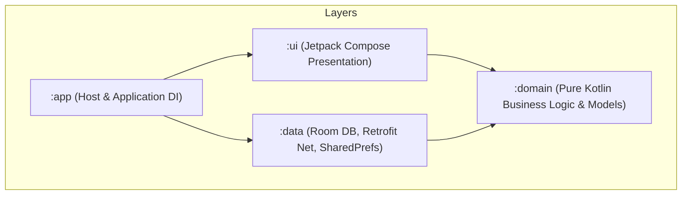

# Lingo English (少儿英语智能学习助手)

Lingo English is an AI-powered interactive English learning application for children and teenagers (Grades 1-6), built on a modular Kotlin & Jetpack Compose Clean Architecture. It uses dynamic LLM (Large Language Model), TTS (Text-to-Speech), and ASR (Automatic Speech Recognition) services to provide personalized oral evaluation, adaptive quiz plans, and an encouraging companion.

---

## 📂 Project Architecture

The project is structured according to **Clean Architecture** principles, separating concerns into isolated Gradle modules:



### Module Responsibilities:
1. **`:domain`**: Zero framework/library dependencies. Declares pure domain entities (`UserProfile`, `VocabItem`, `LearningSession`) and repository interfaces. All code comments are strictly in English.
2. **`:data`**: Local persistence (Room Database) and remote APIs (Retrofit + OkHttp). Implements `:domain` repository interfaces. Manages secure token storage via `SecureConfigPrefs`. Includes Levenshtein distance pronunciation scoring.
3. **`:ui`**: Jetpack Compose presentation layer. Handles state transitions, custom Canvas avatars (`LingoAvatar`), speech bubbles, and internationalization (`strings.xml`).
4. **`:app`**: Application host module. Bootstraps Hilt dependency injection, manages navigation state routing, and includes custom Lingo fox adaptive app icons.

---

## ⚙️ Model Architecture (Unified Provider)

All AI channels (LLM, TTS, ASR) share unified Base URL and Auth Token credentials, configurable at runtime via `SecureConfigPrefs`.

### Default Volcengine (Ark 火山引擎) Config:
- **Base URL**: `https://ark.cn-beijing.volces.com/api/plan/v3`
- **Auth Token**: *(User-configured API Key)*
- **Primary LLM**: `glm-5.2` | **Fallback LLM**: `deepseek-v4-flash`
- **TTS Model**: `seed-tts-2.0` | **ASR Model**: `volc.seedasr.sauc.duration`

---

## 🛠️ How to Build and Run

The project includes a pre-configured Gradle Wrapper (v8.13) and OpenJDK 21 setup (`D:\system\jdk21`).

### Windows PowerShell:
```powershell
# Compile debug APK
.\gradlew.bat assembleDebug

# Run unit tests
.\gradlew.bat test

# Build release APK
.\gradlew.bat assembleRelease
```

Generated APKs:
- Debug: `app\build\outputs\apk\debug\app-debug.apk`
- Release: `app\build\outputs\apk\release\app-release.apk`

---

## 🚀 Release History Summary

| Release | Sprint | Key Capabilities | Status |
|---|---|---|---|
| **v1.0** | Sprints 0–4 | Clean Arch skeleton, Onboarding, Dashboard, ESA 5-stage loop, ErrorBook, Widgets & Reminders | ✅ Released |
| **v1.5** | Sprint 5 | Resilient Learning Engine (state machine, checkpoint resume, exception paths, emotional intervention) | ✅ Released |
| **v1.6** | Sprint 6 | AI Presence Transparency (`AgentDecisionLog`, observation bubbles, plan annotations, AI Growth Notes) | ✅ Released |
| **v2.0** | Sprint 7 | Pedagogical Deepening (PreTeach Engage, Phonics blending, attribution Agent, makeup cards) | ✅ Released |
| **v3.0** | Sprints 10–14 | Visible Growth, Agent Companion (Roleplay 2.0), Real Audio Immersion, Personalized Widgets | ✅ Released |
| **v3.5** | Sprint 15 | Dedicated Speech Assessment API, shame-free color palette, frustration engine, PEP textbook alignment | ✅ Released |
| **v4.0** | Sprint 16 | Launch Readiness (Freemium 30-session gate, Eye Protection timer, Voice Growth Record, Daily Achievement Card) | ✅ Released |
| **v4.1** | Sprint 17 | UX Polish & Emotional Bonding (Dashboard loading skeleton, Meet Lingo screen, Stage micro-celebrations, Recall bubble) | ✅ Released |
| **v4.2** | Sprint 18 | Intelligence & Exam Prep (ErrorBook graduation observation, PEP Unit Test mode, Adaptive session length, Bedtime story) | ✅ Released |
| **v4.3** | Sprint 19 | Fluency Breakthrough & Offline Resilience (Shadowing mode, Offline content pack, Challenge track, CEFR mapper, Growth report card) | ✅ Released |
| **v4.4** | Sprint 20 | Core Path Hardening (First-launch Key gate, onboarding→AI plan funnel, adaptive text layout, Error Book write/display fix, real TTS playback) | ✅ Released |
| **v4.4.1** | Sprint 20 | Hotfix (visible AI configuration confirmation required before proceeding) | ✅ Released |
| **v4.5** | Sprint 20.5 | Agent Plan Voice Channels + UX Polish (LLM plan API wiring, plan TTS NDJSON synthesis with MP3 cache, plan ASR WebSocket transcription, voice endpoint gate fields, CEFR mapping fix, ASR error surfacing, text layout fixes) | ✅ Released |
| **v4.5.1** | Sprint 20.5 | Hotfix (strict AI content: no canned fallbacks for eval questions & plans, real token budget for plan generation, task-aware timeouts, eval-question voice) | ✅ Released |

> For complete detailed task checklists and backlog item status, see [task.md](file:///d:/workbench/sandbox/english-learning-agent/task.md).
