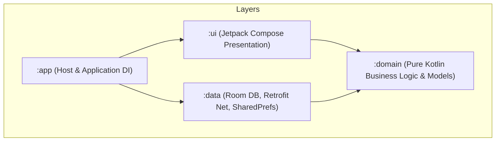

# Lingo English (少儿英语智能学习助手)

Lingo English is an AI-powered interactive English learning application for children and teenagers (Grades 4-12), built on a modular Kotlin & Jetpack Compose Clean Architecture. It uses dynamic LLM (Large Language Model), TTS (Text-to-Speech), and ASR (Automatic Speech Recognition) services to provide personalized oral evaluation, adaptive quiz plans, and an encouraging companion.

---

## 📂 Project Architecture

The project is structured according to **Clean Architecture** principles, separating concerns into isolated Gradle modules:



### Module Responsibilities:
1. **`:domain`**: Zero framework/library dependencies. Declares pure domain entities (e.g., `UserProfile`, `VocabItem`, `LearningSession`, `QuizQuestion`) and repository interface declarations. All code comments are strictly written in English.
2. **`:data`**: Integrates persistent local data sources (Room Database) and remote APIs (Retrofit with OkHttp). Implements the repository interfaces declared in `:domain`. Utilizes `EncryptedSharedPreferences` (`SecureConfigPrefs`) for secure token storage. Includes `AsrRepositoryImpl` with Levenshtein distance pronunciation scoring.
3. **`:ui`**: Jetpack Compose presentation layer. Handles views, responsive state transitions, custom Canvas avatars (`LingoAvatar`), and internationalization (`res/values/strings.xml`). Sprint 2 adds the daily learning flow (`LearningViewModel` + Hilt ViewModels + `AudioPlayerController`).
4. **`:app`**: The application module. Bootstraps the application, injects dependencies using Hilt, and coordinates the startup navigation state machine. Includes custom Lingo fox adaptive app icon.

---

## 🔄 Development & Quality Workflow (5-Step Pipeline)

To guarantee that every Sprint yields a runnable, robust MVP release, all features are developed following our 5-step quality pipeline (see [docs/dev-workflow.md](file:///d:/workbench/sandbox/english-learning-agent/docs/dev-workflow.md)):

1. **`Impl` (Implementation)**: Clean code & English comments strictly maintained across all modules.
2. **`Unit Test & Build`**: Run `./gradlew test assembleDebug` to ensure zero compilation or runtime dependency issues.
3. **`Review & Reflection`**: Self-review edge cases and document continuous skill reflections.
4. **`Docs Sync`**: Keep `readme.md`, `agents.md`, `implementation_plan.md`, `task.md`, and `walkthrough.md` updated at every Sprint end.
5. **`MVP Verification`**: Validate that `app-debug.apk` builds and runs cleanly.

---

## ⚙️ Model Testing Configuration (Unified Provider)

All AI channels (LLM, TTS, ASR) share unified Base URL and Auth Token credentials, configurable at runtime via `SecureConfigPrefs`.

### Default Volcengine (Ark 火山引擎) Test Config:
- **Base URL**: `https://ark.cn-beijing.volces.com/api/plan`
- **Auth Token**: *(Your Ark API Key)*
- **Primary LLM**: `glm-5.2`
- **Fallback LLM**: `deepseek-v4-flash`
- **TTS Model**: `seed-tts-2.0`
- **ASR Model**: `volc.seedasr.sauc.duration`

---

## 🛠️ How to Compile and Build (MVP Runnable Version)

The project includes a pre-configured Gradle Wrapper (v8.13) and standalone OpenJDK 21 setup (`D:\system\jdk21`).

### Windows PowerShell:
```powershell
# Compiles and generates debug APK
.\gradlew.bat assembleDebug
```

Output APK will be generated at:
`app\build\outputs\apk\debug\app-debug.apk`

---

## 🎓 Sprint 7 (V2.0): Pedagogical Deepening & Agent Intelligence

Sprint 7 turns Lingo from a "rule engine with copywriting" into a product that genuinely understands and adapts to the child. It layers pedagogical core activities and bounded-autonomy agent decision-making onto the Sprint 6 AI Presence infrastructure.

### New Capabilities
1. **Pedagogical core activities**: Pre-teach ESA Engage (picture-to-word warm-up), Phonics blending for PRIMARY (CVC build / onset-rime / minimal pairs), spaced repetition in Quiz (Ebbinghaus 1/3/7/14 days), and deterministic production scoring (SPELLING / DICTATION / SENTENCE_WRITING).
2. **Bounded-autonomy agent**: `DiagnoseAnomalyUseCase` maps a structured learning summary to one of 5 categories with confidence; below 0.6 confidence it **defers to the parent** instead of acting alone.
3. **Gamification**: XP + 30-level system with full-screen level-up celebration, daily 3-goal badges, and hint/skip completion.
4. **Adaptive difficulty**: sentence length (±3 words, clamped 4–22) and CEFR level derived from last quiz accuracy, logged to `AgentDecisionLog`.
5. **Parent reports**: per-word review tags, time-by-activity distribution, shareable report text (covers PDF/WeChat export).
6. **Makeup cards**: 2/month; a streak break triggers an **active choice** (never auto-used), preserving the child's agency.

### Review & Reflection (Phase E)
- **ESA model**: The PreTeach flow follows Engage → Study → Activate. Engage uses image-to-word matching (word hidden behind `❓` until matched); Study reveals the word with TTS; Activate proceeds into Immersion. Wrong matches keep the word hidden, so the child self-corrects without pressure.
- **Bounded autonomy**: Agents only report confident judgements (≥0.6) and defer otherwise. This is the correct design for a children's product — the agent surfaces evidence, the parent makes the call. Confidence is a float that gets logged alongside the decision for transparency.
- **Spaced repetition on mobile**: Ebbinghaus 1/3/7/14 day intervals are a pragmatic mobile fit — long enough to exercise memory, short enough to stay relevant. Due words are injected at the **front** of the daily Quiz (max 2) so they are not skipped when a child abandons a long session. A repeated mistake resets to day 1; `intervalIndexForTimestamp` lets a late-correct word skip ahead (catch-up) instead of punishing it.
- **Deterministic production scoring**: ASR cannot grade spelling or sentence writing reliably, so free-text production tasks use Levenshtein partial credit (spelling), word overlap (dictation), and target-word presence + length (sentence writing) — deterministic and unit-testable.
- **On-device verification (V2.0)**: Full flow walked on emulator — PreTeach Engage (word reveal on correct match), Immersion, Practice Listen-Repeat-Compare (offline ASR fallback scored 88), Game (2-combo), Quiz (fill-blank / listen-choose), emotional-intervention dialog, and Results summary with Sprint 7 XP summary running without crash. `lingo_xp_prefs.xml` persisted (`total_xp=40`, makeup month `2026-08`).
- **Test status**: 71 new unit tests across the 8 Sprint 7 domain modules; only pre-existing failures remain (`SessionBuilderTest` quiz-size bound, `AsrRepositoryTest` offline-fallback scoring, `LlmRepositoryImplTest` network-dependent) — all confirmed identical on pristine HEAD.
