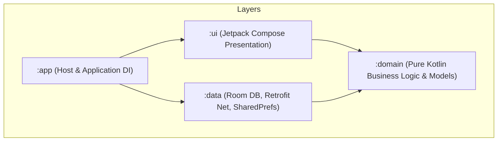

# Lingo English (少儿英语智能学习助手)

Lingo English is an AI-powered interactive English learning application for children and teenagers (Grades 4-12), built on a modular Kotlin & Jetpack Compose Clean Architecture. It uses dynamic LLM (Large Language Model), TTS (Text-to-Speech), and ASR (Automatic Speech Recognition) services to provide personalized oral evaluation, adaptive quiz plans, and an encouraging companion.

---

## 📂 Project Architecture

The project is structured according to **Clean Architecture** principles, separating concerns into isolated Gradle modules:



### Module Responsibilities:
1. **`:domain`**: Zero framework/library dependencies. Declares pure domain entities (e.g., `UserProfile`, `VocabItem`, `LearningSession`, `QuizQuestion`) and repository interface declarations. All code comments are strictly written in English.
2. **`:data`**: Integrates persistent local data sources (Room Database) and remote APIs (Retrofit with OkHttp). Implements the repository interfaces declared in `:domain`. Utilizes `EncryptedSharedPreferences` (`SecureConfigPrefs`) for secure token storage. Includes `AsrRepositoryImpl` with Levenshtein distance pronunciation scoring.
3. **`:ui`**: Jetpack Compose presentation layer. Handles views, responsive state transitions, custom Canvas avatars (`LingoAvatar`), and internationalization (`res/values/strings.xml`). Sprint 2 adds the daily learning flow (`LearningViewModel` + Hilt ViewModels + `AudioPlayerController`).
4. **`:app`**: The application module. Bootstraps the application, injects dependencies using Hilt, and coordinates the startup navigation state machine. Includes custom Lingo fox adaptive app icon.

---

## 🔄 Development & Quality Workflow (5-Step Pipeline)

To guarantee that every Sprint yields a runnable, robust MVP release, all features are developed following our 5-step quality pipeline (see [docs/dev-workflow.md](file:///d:/workbench/sandbox/english-learning-agent/docs/dev-workflow.md)):

1. **`Impl` (Implementation)**: Clean code & English comments strictly maintained across all modules.
2. **`Unit Test & Build`**: Run `./gradlew test assembleDebug` to ensure zero compilation or runtime dependency issues.
3. **`Review & Reflection`**: Self-review edge cases and document continuous skill reflections.
4. **`Docs Sync`**: Keep `readme.md`, `agents.md`, `implementation_plan.md`, `task.md`, and `walkthrough.md` updated at every Sprint end.
5. **`MVP Verification`**: Validate that `app-debug.apk` builds and runs cleanly.

---

## ⚙️ Model Testing Configuration (Unified Provider)

All AI channels (LLM, TTS, ASR) share unified Base URL and Auth Token credentials, configurable at runtime via `SecureConfigPrefs`.

### Default Volcengine (Ark 火山引擎) Test Config:
- **Base URL**: `https://ark.cn-beijing.volces.com/api/plan`
- **Auth Token**: *(Your Ark API Key)*
- **Primary LLM**: `glm-5.2`
- **Fallback LLM**: `deepseek-v4-flash`
- **TTS Model**: `seed-tts-2.0`
- **ASR Model**: `volc.seedasr.sauc.duration`

---

## 🛠️ How to Compile and Build (MVP Runnable Version)

The project includes a pre-configured Gradle Wrapper (v8.13) and standalone OpenJDK 21 setup (`D:\system\jdk21`).

### Windows PowerShell:
```powershell
# Compiles and generates debug APK
.\gradlew.bat assembleDebug
```

Output APK will be generated at:
`app\build\outputs\apk\debug\app-debug.apk`
