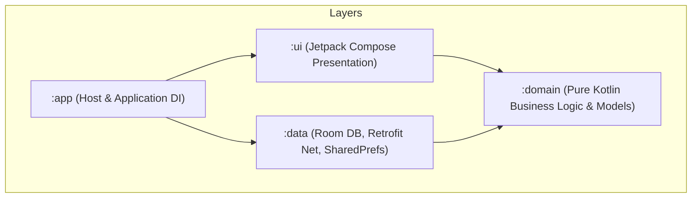

# Lingo English (少儿英语智能学习助手)

Lingo English is an AI-powered interactive English learning application for children and teenagers (Grades 1-6), built on a modular Kotlin & Jetpack Compose Clean Architecture. It uses dynamic LLM (Large Language Model), TTS (Text-to-Speech), and ASR (Automatic Speech Recognition) services to provide personalized oral evaluation, adaptive quiz plans, and an encouraging companion.

---

## 📂 Project Architecture

The project is structured according to **Clean Architecture** principles, separating concerns into isolated Gradle modules:



### Module Responsibilities:
1. **`:domain`**: Zero framework/library dependencies. Declares pure domain entities (`UserProfile`, `VocabItem`, `LearningSession`) and repository interfaces. All code comments are strictly in English.
2. **`:data`**: Local persistence (Room Database) and remote APIs (Retrofit + OkHttp). Implements `:domain` repository interfaces. Manages secure token storage via `SecureConfigPrefs`. Includes Levenshtein distance pronunciation scoring.
3. **`:ui`**: Jetpack Compose presentation layer. Handles state transitions, custom Canvas avatars (`LingoAvatar`), speech bubbles, and internationalization (`strings.xml`).
4. **`:app`**: Application host module. Bootstraps Hilt dependency injection, manages navigation state routing, and includes custom Lingo fox adaptive app icons.

---

## ⚙️ Model Architecture (Unified Provider)

All AI channels (LLM, TTS, ASR) share unified Base URL and Auth Token credentials, configurable at runtime via `SecureConfigPrefs`.

### Default Volcengine (Ark 火山引擎) Config:
- **Base URL**: `https://ark.cn-beijing.volces.com/api/plan/v3`
- **Auth Token**: *(User-configured API Key)*
- **Primary LLM**: `glm-5.2` | **Fallback LLM**: `deepseek-v4-flash`
- **TTS Model**: `seed-tts-2.0` | **ASR Model**: `volc.seedasr.sauc.duration`

---

## 🤖 Agent System

Lingo English runs a family of specialized AI agents, each with a typed contract (structured input context, JSON/rule output, `taskType`, and token budget). They share one unified LLM harness (see below) but differ in *when to trust the model* vs. *when to use deterministic rules*.

### Agent Roster

| Agent | Where | Kind | Contract |
|---|---|---|---|
| **Weekly Plan Generator** | `WeeklyPlanRepositoryImpl` | LLM (`PLAN`) | 7-day plan JSON with per-day `rationale`; strict content (no canned plan) |
| **Diagnostic Quiz Generator** | `DiagnosisViewModel` | LLM (`DIAGNOSIS`) | 10-question JSON across 7 question types; parser fuzzy-maps model synonyms |
| **Pronunciation Evaluator** | `AsrRepositoryImpl` | Deterministic (ASR + Levenshtein) | Word-level score 0-100; no fabricated score when ASR fails |
| **Explanation Agent (Error Book)** | `ExplanationAgentUseCase` | LLM (`EXPLAIN`) | <100-word kid-friendly word explanation from error history |
| **Daily Encourager** | `DailyEncouragerUseCase` | LLM (`ENCOURAGEMENT`) | <40-char gamified greeting with 1 emoji |
| **Observation Agent** | `ObservationTriggerEngine` | Rule-based (longitudinal) | Cross-time insight vs last 7 days of records; template messages |
| **Roleplay Scenario Agent** | `RoleplayScenarioBank` | LLM (`ROLEPLAY_SCENARIO`) + curated offline bank | Scenario `system_prompt` + `opening_line`; offline-safe fallback |
| **Weekly Lingo Letter** | `WeeklyReportViewModel` | LLM (`LINGO_LETTER`) + template fallback | ≤60-word parent digest of the week |
| **On-demand Quiz Hint** | `LearningViewModel` | LLM | 1-sentence guided hint without giving away the answer |
| **Anomaly Diagnoser** | `DiagnoseAnomalyUseCase` | Bounded-autonomy rules | Maps learning summary to 1 of 5 categories; **defers to parent when confidence < 0.6** |
| **Decision Transparency Layer** | `AgentDecisionLog` | Persistence | Every significant agent judgment logged for the "why" surfaces |

Supporting engines: `SpacedRepetitionScheduler` (Ebbinghaus 1/3/7/14d), `PhonicsModule` (CVC blending), `ProductionTaskScorer` (SPELLING/DICTATION/SENTENCE_WRITING), `AdaptiveDifficultyEngine` (sentence length ±3), `XpRewardSystem` + `DailyGoalTracker` + `MakeupCardManager`.

### Unified LLM Harness (`LlmRepositoryImpl`)

- One `complete(prompt, taskType, maxTokens)` entry point; every agent routes through it.
- **Task-aware timeouts**: PLAN/DIAGNOSIS get up to 90s (reasoning-heavy JSON), lighter tasks get shorter budgets; OkHttp socket read timeout 120s as the outer safety net.
- **Model fallback**: primary `glm-5.2` → fallback `deepseek-v4-flash` on failure.
- **Shared credentials** via `SecureConfigPrefs` (Base URL + Auth Token for LLM/TTS/ASR).

### Design Principles

1. **Strict AI content — no fake results.** Evaluation questions, plans, and voice scores never silently degrade to canned/offline content that *looks* AI-generated. On real failure the app surfaces an error with a Retry, so a child is never rewarded with a fabricated score or plan.
2. **Deterministic where it matters.** Pronunciation, production tasks, and spaced-repetition scheduling are rule-scored — the pedagogically critical and latency-sensitive paths never depend on model flakiness.
3. **Template-first, LLM-enriched.** Observation messages and roleplay scripts ship curated, offline-safe templates; the LLM enriches when available, and a failed call keeps the curated version.
4. **Bounded autonomy.** The anomaly diagnoser only acts when confident (≥0.6); otherwise the parent decides from raw evidence.
5. **Transparency by design.** `AgentDecisionLog` feeds the plan "Why this arrangement?", the weekly "What Lingo adjusted", and the AI Growth Notes timeline — the judgment process is visible, not a spinner.

---

## 🛠️ How to Build and Run

The project includes a pre-configured Gradle Wrapper (v8.13) and OpenJDK 21 setup (`D:\system\jdk21`).

### Windows PowerShell:
```powershell
# Compile debug APK
.\gradlew.bat assembleDebug

# Run unit tests
.\gradlew.bat test

# Build release APK
.\gradlew.bat assembleRelease
```

Generated APKs:
- Debug: `app\build\outputs\apk\debug\app-debug.apk`
- Release: `app\build\outputs\apk\release\app-release.apk`

---

## 🚀 Release History Summary

| Release | Sprint | Key Capabilities | Status |
|---|---|---|---|
| **v1.0** | Sprints 0–4 | Clean Arch skeleton, Onboarding, Dashboard, ESA 5-stage loop, ErrorBook, Widgets & Reminders | ✅ Released |
| **v1.5** | Sprint 5 | Resilient Learning Engine (state machine, checkpoint resume, exception paths, emotional intervention) | ✅ Released |
| **v1.6** | Sprint 6 | AI Presence Transparency (`AgentDecisionLog`, observation bubbles, plan annotations, AI Growth Notes) | ✅ Released |
| **v2.0** | Sprint 7 | Pedagogical Deepening (PreTeach Engage, Phonics blending, attribution Agent, makeup cards) | ✅ Released |
| **v3.0** | Sprints 10–14 | Visible Growth, Agent Companion (Roleplay 2.0), Real Audio Immersion, Personalized Widgets | ✅ Released |
| **v3.5** | Sprint 15 | Dedicated Speech Assessment API, shame-free color palette, frustration engine, PEP textbook alignment | ✅ Released |
| **v4.0** | Sprint 16 | Launch Readiness (Freemium 30-session gate, Eye Protection timer, Voice Growth Record, Daily Achievement Card) | ✅ Released |
| **v4.1** | Sprint 17 | UX Polish & Emotional Bonding (Dashboard loading skeleton, Meet Lingo screen, Stage micro-celebrations, Recall bubble) | ✅ Released |
| **v4.2** | Sprint 18 | Intelligence & Exam Prep (ErrorBook graduation observation, PEP Unit Test mode, Adaptive session length, Bedtime story) | ✅ Released |
| **v4.3** | Sprint 19 | Fluency Breakthrough & Offline Resilience (Shadowing mode, Offline content pack, Challenge track, CEFR mapper, Growth report card) | ✅ Released |
| **v4.4** | Sprint 20 | Core Path Hardening (First-launch Key gate, onboarding→AI plan funnel, adaptive text layout, Error Book write/display fix, real TTS playback) | ✅ Released |
| **v4.4.1** | Sprint 20 | Hotfix (visible AI configuration confirmation required before proceeding) | ✅ Released |
| **v4.5** | Sprint 20.5 | Agent Plan Voice Channels + UX Polish (LLM plan API wiring, plan TTS NDJSON synthesis with MP3 cache, plan ASR WebSocket transcription, voice endpoint gate fields, CEFR mapping fix, ASR error surfacing, text layout fixes) | ✅ Released |
| **v4.5.1** | Sprint 20.5 | Hotfix (strict AI content: no canned fallbacks for eval questions & plans, real token budget for plan generation, task-aware timeouts, eval-question voice) | ✅ Released |
| **v4.5.2** | Sprint 20.5 | UX & Reliability Fix Pack (all diagnostic question types render & are tappable, plan errors retryable with friendly messages, weekly-plan accuracy fix, English parent tips, report/error-book layout polish, structured session journey stepper) | ✅ Released |
| **v4.5.3** | Sprint 20.5 | Voice Check & Loading Experience Fix Pack (30s ASR WebSocket timeout so voice check can't hang, diagnostic voice-check error messages by cause, progressive quiz-loading status) | ✅ Released |
| **v4.5.4** | Sprint 20.5 | Answer Layout & Read-Along Resilience Fix Pack (no mid-word wrapping in answer options, read-along Skip when ASR service is down) | ✅ Released |
| **v4.6.0** | Sprint 21 | AI Agent Harness Hardening (validate-and-repair JSON schema loop, versioned prompt registry, single-source StudentContextService, LLM call trace panel, progressive SSE streaming diagnosis, output safety guardrails) | ✅ Released |
| **v4.7.0** | Sprint 22 | Chinese UI Localization & Bilingual Scaffolding (standardized strings catalog, Locale.SIMPLIFIED_CHINESE switching, localized parent & navigation chrome with strict English learning content immersion) | ✅ Released |

> For complete detailed task checklists and backlog item status, see [task.md](file:///d:/workbench/sandbox/english-learning-agent/task.md).
