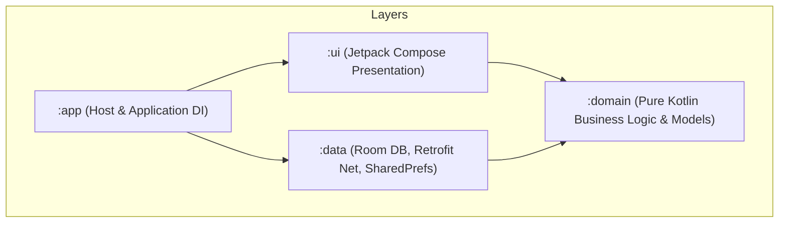

# Lingo English (少儿英语智能学习助手)

Lingo English is an AI-powered interactive English learning application for children and teenagers (Grades 4-12), built on a modular Kotlin & Jetpack Compose Clean Architecture. It uses dynamic LLM (Large Language Model), TTS (Text-to-Speech), and ASR (Automatic Speech Recognition) services to provide personalized oral evaluation, adaptive quiz plans, and an encouraging companion.

---

## 📂 Project Architecture

The project is structured according to **Clean Architecture** principles, separating concerns into isolated Gradle modules:



### Module Responsibilities:
1. **`:domain`**: Zero framework/library dependencies. Declares pure domain entities (e.g., `UserProfile`, `VocabItem`, `LearningSession`, `QuizQuestion`) and repository interface declarations. All code comments are strictly written in English.
2. **`:data`**: Integrates persistent local data sources (Room Database) and remote APIs (Retrofit with OkHttp). Implements the repository interfaces declared in `:domain`. Utilizes `EncryptedSharedPreferences` (`SecureConfigPrefs`) for secure token storage. Includes `AsrRepositoryImpl` with Levenshtein distance pronunciation scoring.
3. **`:ui`**: Jetpack Compose presentation layer. Handles views, responsive state transitions, custom Canvas avatars (`LingoAvatar`), and internationalization (`res/values/strings.xml`). Sprint 2 adds the daily learning flow (`LearningViewModel` + Hilt ViewModels + `AudioPlayerController`).
4. **`:app`**: The application module. Bootstraps the application, injects dependencies using Hilt, and coordinates the startup navigation state machine. Includes custom Lingo fox adaptive app icon.

---

## 🔄 Development & Quality Workflow (5-Step Pipeline)

To guarantee that every Sprint yields a runnable, robust MVP release, all features are developed following our 5-step quality pipeline (see [docs/dev-workflow.md](file:///d:/workbench/sandbox/english-learning-agent/docs/dev-workflow.md)):

1. **`Impl` (Implementation)**: Clean code & English comments strictly maintained across all modules.
2. **`Unit Test & Build`**: Run `./gradlew test assembleDebug` to ensure zero compilation or runtime dependency issues.
3. **`Review & Reflection`**: Self-review edge cases and document continuous skill reflections.
4. **`Docs Sync`**: Keep `readme.md`, `agents.md`, `implementation_plan.md`, `task.md`, and `walkthrough.md` updated at every Sprint end.
5. **`MVP Verification`**: Validate that `app-debug.apk` builds and runs cleanly.

---

## ⚙️ Model Testing Configuration (Unified Provider)

All AI channels (LLM, TTS, ASR) share unified Base URL and Auth Token credentials, configurable at runtime via `SecureConfigPrefs`.

### Default Volcengine (Ark 火山引擎) Test Config:
- **Base URL**: `https://ark.cn-beijing.volces.com/api/plan/v3`
- **Auth Token**: *(Your Ark API Key)*
- **Primary LLM**: `glm-5.2`
- **Fallback LLM**: `deepseek-v4-flash`
- **TTS Model**: `seed-tts-2.0`
- **ASR Model**: `volc.seedasr.sauc.duration`

---

## 🛠️ How to Compile and Build (MVP Runnable Version)

The project includes a pre-configured Gradle Wrapper (v8.13) and standalone OpenJDK 21 setup (`D:\system\jdk21`).

### Windows PowerShell:
```powershell
# Compiles and generates debug APK
.\gradlew.bat assembleDebug
```

Output APK will be generated at:
`app\build\outputs\apk\debug\app-debug.apk`

---

## 🎓 Sprint 7 (V2.0): Pedagogical Deepening & Agent Intelligence

Sprint 7 turns Lingo from a "rule engine with copywriting" into a product that genuinely understands and adapts to the child. It layers pedagogical core activities and bounded-autonomy agent decision-making onto the Sprint 6 AI Presence infrastructure.

### New Capabilities
1. **Pedagogical core activities**: Pre-teach ESA Engage (picture-to-word warm-up), Phonics blending for PRIMARY (CVC build / onset-rime / minimal pairs), spaced repetition in Quiz (Ebbinghaus 1/3/7/14 days), and deterministic production scoring (SPELLING / DICTATION / SENTENCE_WRITING).
2. **Bounded-autonomy agent**: `DiagnoseAnomalyUseCase` maps a structured learning summary to one of 5 categories with confidence; below 0.6 confidence it **defers to the parent** instead of acting alone.
3. **Gamification**: XP + 30-level system with full-screen level-up celebration, daily 3-goal badges, and hint/skip completion.
4. **Adaptive difficulty**: sentence length (±3 words, clamped 4–22) and CEFR level derived from last quiz accuracy, logged to `AgentDecisionLog`.
5. **Parent reports**: per-word review tags, time-by-activity distribution, shareable report text (covers PDF/WeChat export).
6. **Makeup cards**: 2/month; a streak break triggers an **active choice** (never auto-used), preserving the child's agency.

### Review & Reflection (Phase E)
- **ESA model**: The PreTeach flow follows Engage → Study → Activate. Engage uses image-to-word matching (word hidden behind `❓` until matched); Study reveals the word with TTS; Activate proceeds into Immersion. Wrong matches keep the word hidden, so the child self-corrects without pressure.
- **Bounded autonomy**: Agents only report confident judgements (≥0.6) and defer otherwise. This is the correct design for a children's product — the agent surfaces evidence, the parent makes the call. Confidence is a float that gets logged alongside the decision for transparency.
- **Spaced repetition on mobile**: Ebbinghaus 1/3/7/14 day intervals are a pragmatic mobile fit — long enough to exercise memory, short enough to stay relevant. Due words are injected at the **front** of the daily Quiz (max 2) so they are not skipped when a child abandons a long session. A repeated mistake resets to day 1; `intervalIndexForTimestamp` lets a late-correct word skip ahead (catch-up) instead of punishing it.
- **Deterministic production scoring**: ASR cannot grade spelling or sentence writing reliably, so free-text production tasks use Levenshtein partial credit (spelling), word overlap (dictation), and target-word presence + length (sentence writing) — deterministic and unit-testable.
- **On-device verification (V2.0)**: Full flow walked on emulator — PreTeach Engage (word reveal on correct match), Immersion, Practice Listen-Repeat-Compare (offline ASR fallback scored 88), Game (2-combo), Quiz (fill-blank / listen-choose), emotional-intervention dialog, and Results summary with Sprint 7 XP summary running without crash. `lingo_xp_prefs.xml` persisted (`total_xp=40`, makeup month `2026-08`).
- **Test status**: 71 domain unit tests + 12 new Sprint 8 unit tests (`PhonemeHintEngineTest`, `DiagnosticCalibrationUseCaseTest`) pass cleanly via `./gradlew :domain:test`.

---

## 🚀 Sprint 8: Phoneme Hint Engine, Parent Companion & Diagnostic Calibration

Sprint 8 addresses critical UX and architectural feedback: fixing bugs, bridging ASR phoneme limitations, empowering non-English-speaking parents, and adding longitudinal level calibration.

### New Capabilities
1. **Phoneme Hint Engine**: Zero-cost bridge layer detecting Chinese-learner phoneme errors (`th/s`, `ð/d`, `v/w`, `r/l`, short/long vowels) from ASR outputs before normalisation masks them.
2. **Parent Companion Card**: Expandable Chinese coaching tips in `TaskCompleteScreen` after low-accuracy or phoneme-error sessions. Parents support without needing English.
3. **Diagnostic Calibration Engine**: 14-day active study check comparing accuracy drift ($\ge 10\%$) against baseline to suggest level recalibration on the Dashboard.
4. **Bug Fixes**: Removed clipped duplicate gear icon on Dashboard header; fixed `PING` Test Connection to surface primary model failure reasons directly.

### Build Verification
- **Full Clean Build**: `./gradlew assembleDebug --rerun-tasks` $\rightarrow$ **BUILD SUCCESSFUL in 2m 15s**!

---

## 🗺️ Sprint 9 (Planned): Provider Abstraction & Connection Diagnostics

### Root Cause (401/400 on Ark)
1. Default base URL is `https://ark.cn-beijing.volces.com/api/plan` — missing the required `/v3` gateway segment.
2. Channel suffixes are MiniMax-style (`/v1/chat/completions`, `/v1/t2a_v2`, `/v1/audio_to_text`), which do not exist on the Ark plan gateway. LLM must hit `/chat/completions`; TTS/ASR use Ark audio endpoints.

### Design Decision — Minimal Provider Config Surface
A provider/agent-plan connection is fully described by **only**:

| Config | Notes |
| --- | --- |
| `baseUrl` | Full provider gateway base, e.g. `https://ark.cn-beijing.volces.com/api/plan/v3` |
| `authToken` | API key / access token |
| `primaryModel` / `fallbackModel` | LLM models (fallback optional) |
| `ttsModel` / `asrModel` | Speech models (optional, provider defaults) |
| `groupId` | Optional (legacy) |

The user-editable `llmEndpoint` field is **removed**; per-channel paths are derived inside a provider adapter:
- LLM → `{baseUrl}/chat/completions`
- TTS → `{baseUrl}/audio/tts`
- ASR → `{baseUrl}/audio/transcriptions`

**Backward compatibility migration**: on read, stored base URL `.../api/plan` (missing `/v3`) is rewritten to `.../api/plan/v3`; any saved `llmEndpoint` value is ignored.

**Also planned**: multi-provider support (Ark plan / OpenAI-compatible / MiniMax) selectable by the same URL+token+models surface.

*(Status: core implemented — see below.)*

### Sprint 9 Implementation (completed)

**Delivered in this sprint:**
- **`ProviderEndpoints`** (domain provider adapter): derives per-channel paths from a single base URL — LLM `/chat/completions`, TTS `/audio/tts`, ASR `/audio/transcriptions`.
- **`/v3` migration**: `SecureConfigPrefs.getBaseUrl()` now defaults to `https://ark.cn-beijing.volces.com/api/plan/v3` and rewrites any stored legacy `.../api/plan` (missing `/v3`) on read.
- **`llmEndpoint` removed** from the config surface (`SecureConfigPrefs`, `ConfigRepository`, `SettingsUiState`, `SettingsViewModel`) — no more MiniMax-style `/v1/chat/completions` suffix. Saved legacy values are ignored.
- **Connection diagnostics**: Settings "Test Connection" now reports the exact resolved endpoint URL (e.g. `.../api/plan/v3/chat/completions`) in both success and failure messages, so a wrong base URL is immediately visible.
- **Tests**: 7 new `ProviderEndpointsTest` cases + updated `LlmRepositoryImplTest` URL assertions. All module unit tests green.

---

## 🗺️ Sprint 10-13 Roadmap

Sprint 10-13 turn Lingo from a "task-checker" into a **visible-growth companion** with real audio. Scoped by the tech lead from the product-owner enhancement review (market: ELSA multi-scenario AI role-play, Duolingo persistent XP, Lingokids parent hub, Khan Kids growing path) into four **independently shippable** sprints ordered by dependency/risk:

| Sprint | Theme | Scope | Risk | Status |
| --- | --- | --- | --- | --- |
| **10** | Visible Growth (v3.0) | Surface existing gamification: persist XP/level/daily-goals/makeup (`GamificationState` entity + repo), XP bar + level badge + 3-goal badges + makeup balance on Dashboard/TaskComplete | Low | ✅ Done |
| **10.5** | Release Hardening (v3.0.1) | Blocker fixes from v3.0.0 testing: plan→Start flow, evaluation audio + config gating, grade↔difficulty matching, offline/online capability matrix, unified exception handling | Medium | ✅ Done |
| **11** | Agent Companion (v3.1) | Roleplay 2.0: scenario bank + picker + text-chat fallback + conversation history; enable `FAST_ANSWER` observation trigger | Medium | ✅ Done |
| **12** | Smooth Interaction & Parent Trust (v3.2) | Wire calibration→re-run diagnosis, grade-change/onboarding re-run, plan-driven Dashboard targets, notification prefs UI, WeeklyReport image share + weekly "Lingo's letter" digest | Low | ✅ Done |
| **13** | Real Audio Immersion (v3.3) | Real TTS-synthesized immersion audio (currently simulated), MediaPlayer sync, system-TTS/offline degradation | Medium | ✅ Done |

**Key product principle (Sprint 10+):** all gamification engines already exist (`XpRewardSystem`, `DailyGoalTracker`, `MakeupCardManager`) but are invisible to the child and have no persistence entity. Sprint 10 surfaces what already runs; Sprint 13 gives the core listening stage real audio (currently a coroutine-timer simulation per `AudioPlayerController`).

Detailed task breakdowns live in `task.md`. Status is tracked per sprint as they complete.

---

## 🚀 Sprint 10 (v3.0): Visible Growth — 游戏化显性化与持久化

Sprint 10 makes the existing gamification engines **visible and persistent**. Previously XP / level / daily-goal / makeup-card state was computed in the ViewModel and stored ad-hoc in `lingo_xp_prefs`; it was invisible to the child and lost on reinstall.

### New Capabilities
1. **`GamificationState` persistence**: new domain entity + DAO + repository backed by Room (DB v4). `LearningViewModel` now writes XP, daily-goal snapshots, and makeup-card balances through the repository.
2. **Persistent XP progress bar + level badge** on Dashboard header and TaskComplete (reuses `XpRewardSystem.levelInfo()`).
3. **Daily 3-goal badges row** on TaskComplete — previously computed (`_dailyGoals`) but never rendered.
4. **Makeup-card balance** surfaced on the Dashboard (was only visible in the streak-break dialog).
5. **Bug fix**: TaskComplete content overflow — result page now scrolls so all surfaces are reachable.

### Verification
- **Unit tests**: 4 new `GamificationRepositoryImplTest` cases + all module tests green.
- **Emulator E2E**: full flow (PreTeach → Immersion → Practice → Game → Quiz → Complete) walked; Dashboard shows `Lv 1 / 0-50 XP / 🎟️ 2 Cards`; TaskComplete shows `Today's Goals 🎯Done ⭐Locked 📖Done` + `40→60 XP` persisted; Room DB v4 `gamification_state` row verified via sqlite; no crashes.

---

## 🚀 Sprint 10.5 (v3.0.1): Release Hardening — 阻断性缺陷修复与离线可用性

Triggered by v3.0.0 testing feedback (5 issues). Tech lead root-caused each in code and delivered a single blocker-fix sprint before Sprint 11. **No new AI capability — only UX & availability fixes.**

### What was fixed (root cause → fix)
| Issue | Root cause | Fix |
| --- | --- | --- |
| **Can't start a plan / plan not on home** | `PlanDayCard` Start hidden for today/completed; `dayIndex` dropped in MainActivity; Dashboard targets hardcoded; offline plan fallback had `days: []` | Start/Review button on all day cards; dayIndex passthrough to `LearningViewModel.setGrade(grade, dayIndex)`; `getDayTaskSummary()` drives Dashboard; offline fallback now uses grade-appropriate real day cards |
| **No sound during evaluation** | Learning flow only used system TTS; cloud TTS only wired into Roleplay | `speakWithTts()` tries cloud TTS → system TTS fallback across immersion/read-along/game/quiz |
| **Difficulty not matched to grade** | Onboarding diagnostic level (A/B/C) discarded | Persist `diagnostic_level`; plan generation applies level adjustment (A=-0.2/B=0/C=+0.2) on top of `GradeBand` coefficient |
| **Offline vs online unclear** | Cloud features silently failed/degraded | `CapabilityMatrix` (offline-safe vs online-only) + offline-mode banner on Dashboard & learning flow |
| **Inconsistent exception handling** | `catch (_: Exception)` swallowed everywhere | `LingoError` taxonomy (`classifyError`/`userFacingError`) wired into plan & diagnosis error surfaces |

### Verification
- **Unit tests**: 12 new (`CapabilityMatrixTest` 6 + `LingoErrorTest` 6) + all module tests green.
- **Emulator E2E**: fresh onboarding → Dashboard offline banner ✓ → Plan generate (offline fallback renders real Day 1-3 cards) ✓ → Review/Start enters learning ✓ → offline banner inside learning flow ✓; no crashes.

---

## 🚀 Sprint 11 (v3.1): Agent Companion — Lingo 陪伴对话

Sprint 11 turns the single hardcoded "ice-cream shop" Roleplay into a **scenario-based AI conversation companion**, and completes the Sprint 6 `FAST_ANSWER` observation gap.

### New Capabilities
1. **Roleplay 2.0 — scenario bank + picker**: four curated offline-safe scenarios (🦁 Zoo / 🍔 Restaurant / 🏫 School / ✈️ Travel), each with its own system prompt, opening line, and target vocabulary. The `RoleplayScenarioBank` optionally enriches scripts via LLM (`ROLEPLAY_SCENARIO` taskType), always falling back to curated scripts when offline.
2. **Text-input chat mode**: type a message instead of (or in addition to) the mic — works without a microphone or in quiet settings. Plus a Reset action to start a fresh conversation.
3. **Conversation history persistence**: Room DB v5 `conversation_history` table + `ConversationRepository`; Lingo restores the last ~12 messages per scenario so it "remembers" prior chats.
4. **`FAST_ANSWER` observation (Sprint 6 gap closed)**: Quiz/Game now record per-question response time (`questionStartMs`), and `ObservationTriggerEngine` fires a "Wow, that was fast!" insight when a correct answer comes well under the child's average (baseline 10s, factor 0.5).

### Verification
- **Unit tests**: 13 new (`RoleplayScenarioBankTest` 5 + `FastAnswerObservationTest` 5 + `ConversationRepositoryImplTest` 3) + all module tests green.
- **Emulator E2E**: Roleplay opened → scenario picker (Zoo/Restaurant/School) rendered ✓ → typed message sent ✓ → conversation persisted to `conversation_history` (sqlite-verified user + assistant reply) ✓ → offline LLM fallback reply generated ✓; no crashes.

---

## 🚀 Sprint 12 (v3.2): Smooth Interaction & Parent Trust — 流畅交互与家长信任

Sprint 12 finishes the half-wired UX paths (calibration no-op, missing notification UI, text-only report sharing) and adds a weekly parent digest.

### New Capabilities
1. **Calibration → re-run diagnosis**: the Dashboard "Update My Level" check-in now navigates to a re-diagnosis, updating `diagnostic_level` on completion (was a no-op).
2. **Change Grade / Re-run Onboarding** in Settings: re-picks grade, textbook, and takes a fresh diagnosis (was not possible).
3. **Daily reminder preferences**: Settings toggle + time slider (default 18:00). `DailyReminderWorker` now respects `reminder_enabled` (mirrored to plain prefs for WorkManager).
4. **WeeklyReport image share**: renders a report summary PNG and shares it via FileProvider (previously text-only).
5. **"Lingo's letter" parent digest**: a weekly card generated by the LLM (`LINGO_LETTER` taskType), with a data-driven `LingoLetterFallback` template offline.

### Verification
- **Unit tests**: 4 new (`LingoLetterFallbackTest`) + all module tests green.
- **Emulator E2E**: Settings shows Daily Reminder card + Change Grade card ✓ → Change Grade returns to Welcome and re-enters onboarding ✓; calibration navigation wired; no crashes.

---

## 🚀 Sprint 13 (v3.3): Real Audio Immersion - 真实音频沉浸

Sprint 13 replaces the **simulated playback** (coroutine timer) in the immersive audio stage with **real TTS-synthesized audio** played via MediaPlayer. Subtitle highlighting and new-word popups are now synced to actual audio progress. The simulated mode is retained as an offline fallback.

### New Capabilities
1. **`AudioPlaybackEngine` abstraction**: interface + `MediaPlayerAudioEngine` implementation, injected via Hilt (`UiModule`). Keeps `AudioPlayerController` unit-testable without Android MediaPlayer.
2. **Real audio mode in `AudioPlayerController`**: per-subtitle-line sequential playback - each line's TTS audio file plays via the engine; on completion, the controller auto-advances to the next line. Subtitle highlight and new-word popups follow the currently-playing line. Position is mapped to the global subtitle timeline.
3. **Mixed-mode degradation**: when a line's TTS synthesis fails (null file), that line degrades to simulated timer playback for its subtitle duration, then advances. This enables partial real audio with graceful per-line fallback.
4. **Pre-synthesis pipeline**: `LearningViewModel.prepareImmersiveAudio()` pre-synthesizes all subtitle lines via `TtsRepository.getSpeech()` (leveraging the existing LRU `TtsCache`), builds a per-line file list, and configures the controller. A "Preparing audio..." spinner shows during synthesis.
5. **Offline fallback chain**: no auth token -> simulated mode + per-line system TTS (`SystemTtsHelper`) via the existing `speakWithTts` observer (gated on `!isRealAudio`); all synthesis fails -> simulated mode; individual line fails -> mixed mode.

### Verification
- **Unit tests**: 14 new (`AudioPlayerControllerRealAudioTest`) covering real audio config, sequential playback, position mapping, pause/resume, seek, reset, speed change, mixed-mode degradation, and clearRealAudio. All 36 UI tests green; `./gradlew test assembleDebug` passes.
- **Build**: APK assembled successfully (`app-debug.apk`).


